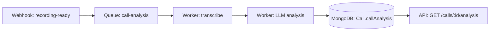
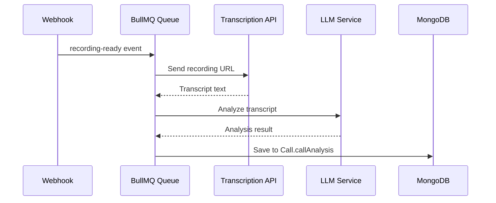
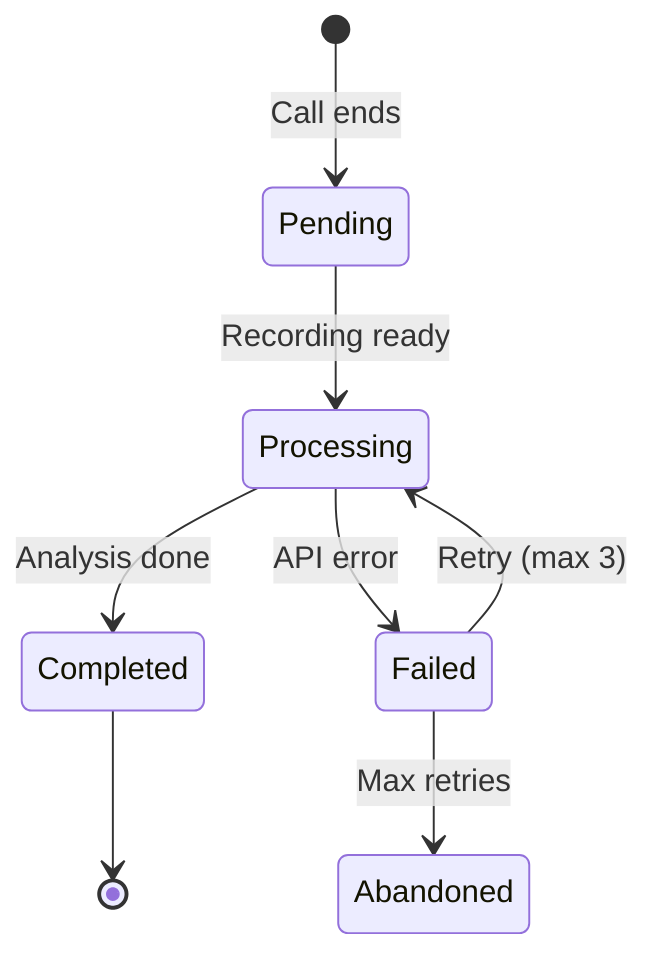
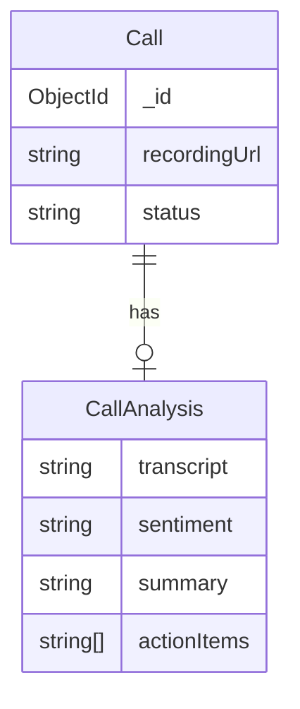

# Plan

Ideate a feature through structured conversation, produce a plan document, and create Linear issues — all without leaving Claude Code.

## Context

Learnings from previous usage (edge cases, patterns, preferences) are auto-merged into this file during sync. To add new learnings, edit the source `LEARNINGS.md` in this skill's folder in the minions repo.

## Core Principles

```
1. CONVERSATION FIRST  - The plan emerges from dialogue, not from a template
2. NUANCES SURFACE     - Ask about edge cases the engineer hasn't considered
3. PLAN IS THE ARTIFACT - The conversation produces a reusable document
4. LINEAR IS TRACKING   - Issues are created from the plan, not vice versa
5. AGENT-READY          - The plan doc must be detailed enough for an agent to execute each sub-task without further clarification
```

---

## Workflow Overview

```
┌─────────────┐     ┌─────────────┐     ┌─────────────┐     ┌─────────────┐     ┌─────────────┐
│   IDEATE    │ ──▶ │  DIAGRAM    │ ──▶ │  DOCUMENT   │ ──▶ │   LINEAR    │ ──▶ │   READY     │
│             │     │             │     │             │     │             │     │             │
│ • Converse  │     │ • Data flow │     │ • Write     │     │ • Parent    │     │ • Branch    │
│ • Edge cases│     │ • System    │     │ • plan doc  │     │ • Sub-issues│     │ • Handoff   │
│ • Decisions │     │ • Approval  │     │ • Diagrams  │     │ • Links     │     │ • Context   │
└─────────────┘     └─────────────┘     └─────────────┘     └─────────────┘     └─────────────┘
```

---

## Phase 1: IDEATE

**Goal:** Have a structured conversation that surfaces all requirements, edge cases, and decisions.

### 1.1 Understand the Feature

Start by understanding what the engineer wants. Ask:

- What problem does this solve?
- What's the user/system flow end-to-end?
- What triggers this feature? (user action, webhook, cron, queue)
- What's the expected output/result?

**Don't ask all at once.** One question at a time, build on answers.

### 1.2 Explore the Codebase

Before going deeper, understand what already exists:

```
Search for:
- Similar features already implemented
- Schemas/models that will be involved
- Services that can be reused or extended
- Existing patterns for this type of feature
- Related queues, schedulers, or webhooks
```

Share findings with the engineer: "I found X already exists, should we extend it or build separately?"

### 1.3 Surface Edge Cases

**This is the most important step.** Engineers often think about the happy path. Your job is to surface what they haven't considered.

Ask about:

| Category | Questions to Ask |
|----------|-----------------|
| **Failure modes** | What happens if X fails? Timeout? Partial failure? |
| **Concurrency** | Can this run in parallel? Race conditions? |
| **Idempotency** | What if the trigger fires twice? Duplicate handling? |
| **Data state** | What if the data is missing/null/stale? |
| **Scale** | How many records? Batch processing needed? |
| **Timing** | Immediate or async? Retry logic? Delays? |
| **Dependencies** | External APIs? What if they're down? |
| **Rollback** | If something goes wrong midway, can we recover? |

**Don't dump all questions at once.** Ask the ones relevant to this specific feature.

### 1.4 Make Decisions

For each ambiguity, present options with trade-offs:

```
For fetching the recording after call ends:

1. **Poll the API every 30s** (Simple)
   - Pro: Easy to implement
   - Con: Wastes API calls, delay up to 30s

2. **Wait for recording-ready webhook** (Recommended)
   - Pro: Immediate, no wasted calls
   - Con: Need to handle webhook registration

3. **Queue with exponential backoff**
   - Pro: Resilient, handles delays
   - Con: More complex, need retry limits

I'd recommend option 2 because [reason]. What do you think?
```

**Record every decision** — these go into the plan doc.

### 1.5 Determine App Location

| Feature Type | App | Reason |
|---|---|---|
| Campaign triggers, webhooks, queues, schedulers, data sync | Execution | Critical path |
| Analytics, dashboards, CRUD, reporting | Operations | Non-critical |

If unclear, ask: "Is this campaign execution, scheduling, webhooks, or data sync?" YES → Execution. NO → Operations.

### 1.6 Identify Sub-Tasks

As the conversation progresses, mentally note the natural task boundaries:

- Schema changes
- New services (each with a clear responsibility)
- New routes/endpoints
- Queue/worker setup
- Webhook handlers
- Configuration/env changes
- Wiring everything together

---

## Phase 2: DIAGRAM

**Goal:** Visualize the system before writing the plan doc. Show to engineer for approval.

After ideation is complete and before writing the plan doc, create diagrams that make the architecture concrete and reviewable.

### 2.1 Choose Diagram Type

Pick the diagram(s) most relevant to the feature:

| Feature Type | Diagram Type | When to Use |
|-------------|-------------|-------------|
| Data pipeline (webhook → queue → service) | **Data Flow Diagram** | Data moves between systems/services |
| API endpoints | **Sequence Diagram** | Request/response between client, server, external APIs |
| State changes (campaign status, call lifecycle) | **State Diagram** | Entity transitions through defined states |
| Multi-service interaction | **System Flow Diagram** | Multiple services coordinate to complete a task |
| Schema relationships | **Data Model Diagram** | New collections or significant schema changes |

For complex features, create **both** a data/system flow AND a data model diagram.

### 2.2 Diagram Format

Use **Mermaid syntax** — it renders in GitHub, Linear, and most markdown viewers.

**Data Flow Diagram:**


**Sequence Diagram:**


**State Diagram:**


**Data Model Diagram:**


### 2.3 Present to Engineer

Show the diagram(s) to the engineer and ask:

```
Here's how I see the system working:

{diagram}

Does this match your mental model? Anything missing or wrong?
```

**Wait for approval before proceeding to the plan doc.**

If the engineer suggests changes, update the diagram and show again. The diagram must be accurate before it goes into the doc.

### 2.4 What Good Diagrams Show

- **Entry points** — what triggers the flow (webhook, cron, user action)
- **Data transformations** — what happens at each step
- **Storage** — where data is read from and written to
- **External dependencies** — third-party APIs, services
- **Failure points** — where things can go wrong (mark with ⚠️ if helpful)
- **Output** — what the end result looks like

### 2.5 What to Avoid

- Don't create diagrams for trivial features (simple CRUD, single endpoint)
- Don't over-detail — show the architecture, not every function call
- Don't mix concerns — separate data flow from state transitions into different diagrams

---

## Phase 3: DOCUMENT

**Goal:** Write the plan document in the repo, including the approved diagrams.

### 3.1 Create the Plan File

```
Location: docs/plans/{feature-name}.md
```

Create the `docs/plans/` directory if it doesn't exist.

### 3.2 Plan Document Structure

```markdown
# {Feature Name}

## Overview
One paragraph explaining what this feature does and why.

## Flow
Step-by-step system/user flow. Use numbered steps.

1. [Trigger] → ...
2. [Process] → ...
3. [Result] → ...

## Diagrams

{Include the approved Mermaid diagrams from Phase 2}

### Data/System Flow
{flowchart or sequence diagram}

### Data Model (if applicable)
{ER diagram showing schema relationships}

### State Transitions (if applicable)
{state diagram}

## Architecture

### App: {Execution | Operations}
Reasoning: {why this app}

### Files to Create/Modify
| File | Action | Purpose |
|------|--------|---------|
| `path/to/file.ts` | CREATE | Description |
| `path/to/existing.ts` | MODIFY | What changes |

### Data Model Changes
{Schema changes, new fields, new collections — or "None"}

### Queue/Worker Setup
{If applicable — queue name, job data, processing logic — or "N/A"}

## Decisions

| Decision | Choice | Alternatives Considered | Reasoning |
|----------|--------|------------------------|-----------|
| How to get recording | Webhook | Polling, queue backoff | Immediate, no waste |
| Where to store analysis | Call document | Separate collection | Co-located, simpler queries |

## Edge Cases & Error Handling

| Scenario | Handling |
|----------|----------|
| Recording not ready | Retry with backoff, max 5 attempts |
| Duplicate webhook | Idempotency check on callId |
| Analysis API timeout | Mark as failed, alert, manual retry |

## Sub-Tasks

1. **{Task title}**
   - What: {detailed description}
   - Files: {files involved}
   - Dependencies: {what must be done first}

2. **{Task title}**
   - What: {detailed description}
   - Files: {files involved}
   - Dependencies: {what must be done first}

{Repeat for each sub-task}

## Open Questions
{Any unresolved questions — or "None, all clarified during planning"}
```

### 3.3 Write With Agent Execution in Mind

Each sub-task description must be detailed enough that an agent can execute it without asking further questions. Include:

- Exact file paths to create/modify
- Which existing patterns to follow (reference files)
- Schema field names, types, and validation
- API endpoint paths and request/response shapes
- Error handling expectations
- What to test

**Bad sub-task:**
```
Add the analysis service
```

**Good sub-task:**
```
Create analysis service at apps/execution/src/services/call/call.analysis.ts

- Input: { callId: string, recordingUrl: string }
- Output: { transcript: string, sentiment: string, summary: string, actionItems: string[] }
- Call transcription API (see @services/ai/transcription.ts for pattern)
- Pass transcript to LLM for structured analysis (see @ai-services/prompt.service.ts)
- Save result to Call.callAnalysis field
- Handle: API timeout (throw, let queue retry), invalid recording URL (mark failed)
- Follow pattern in: apps/execution/src/services/email/emailAutomation.service.ts
```

### 3.4 Review the Plan With Engineer

After writing the plan doc, present a summary:

```
Plan written to docs/plans/{feature-name}.md

Summary:
- {X} sub-tasks identified
- App: {Execution/Operations}
- New files: {count}
- Modified files: {count}
- Schema changes: {yes/no}
- Queue needed: {yes/no}

Shall I create Linear issues from this plan?
```

**Wait for approval before creating Linear issues.**

---

## Phase 4: LINEAR

**Goal:** Create parent issue and sub-issues in Linear.

### 4.1 Determine Linear Context

Use Linear MCP tools to:
1. List teams → find the right team (usually "Engineering")
2. List projects → find or confirm the project
3. List labels → use appropriate labels

### 4.2 Create Parent Issue

Use `create_issue` MCP tool:

```
Title: {Feature name} — {one-line summary}
Team: Engineering
Project: {relevant project, e.g., "Torrent"}
Label: Feature
Priority: {ask engineer if not obvious}
Description:
  ## Plan
  See: `docs/plans/{feature-name}.md` in the repo

  ## Overview
  {Copy the Overview section from plan doc}

  ## Flow
  {Copy the Flow section from plan doc}

  ## Diagrams
  {Copy the Mermaid diagrams from plan doc}

  ## Decisions
  {Copy the Decisions table from plan doc}

  ## Edge Cases & Error Handling
  {Copy the Edge Cases table from plan doc}

  ## Sub-Tasks
  {List sub-task titles as checklist}
  - [ ] Sub-task 1
  - [ ] Sub-task 2
  - [ ] Sub-task 3
```

### 4.3 Create Sub-Issues (for tracking, not separate PRs)

Sub-issues track progress within the feature. They all ship together in **one PR**.

For each sub-task in the plan, create a sub-issue:

```
Title: {Sub-task title}
Team: Engineering
Parent: {parent issue ID}
Label: Feature
Priority: Same as parent
Description:
  ## What
  {Detailed description from plan doc sub-task}

  ## Files
  {Files to create/modify}

  ## Dependencies
  {Which sub-tasks must be done first}

  ## Pattern Reference
  {Which existing files to follow}

  ## Plan Doc
  See: `docs/plans/{feature-name}.md` for full context
```

**Note:** All sub-issues are worked on the same feature branch. When the feature is complete, one PR covers everything. Sub-issues are moved to "Done" when their code is written, and the parent issue moves to "In Review" when the PR is opened.

### 4.4 Link Everything

After creating all issues:
1. Note the parent issue identifier (e.g., `ENG-123`)
2. Add the issue identifier to the plan doc header:

```markdown
# {Feature Name}

**Linear:** ENG-123 | **Branch:** feature/ENG-123-{feature-name}
```

### 4.5 Report to Engineer

```
Linear issues created:

Parent: ENG-123 — {Feature name}
├── ENG-124: {Sub-task 1}
├── ENG-125: {Sub-task 2}
├── ENG-126: {Sub-task 3}
├── ENG-127: {Sub-task 4}
└── ENG-128: {Sub-task 5}

Plan doc: docs/plans/{feature-name}.md
Branch: feature/ENG-123-{feature-name} (not created yet)

All sub-tasks will be worked on one branch: feature/ENG-123-{feature-name}
One PR will be opened when the feature is complete.

Ready to start?
```

---

## Phase 5: READY

**Goal:** Set up the engineer to start executing.

### 5.1 Create Feature Branch

```bash
git checkout main
git pull origin main
git checkout -b feature/{issue-id}-{feature-name}
```

### 5.2 Commit the Plan Doc

```bash
git add docs/plans/{feature-name}.md
git commit -m "(docs): add plan for {feature-name}

Planning doc for ENG-123. Covers flow, architecture, decisions, and sub-tasks."
```

### 5.3 Update Linear Status

Move the parent issue to In Progress — implementation is starting:

```
Use update_issue MCP tool to move parent issue (ENG-123) to "In Progress"
```

### 5.4 Handoff

The engineer can now:
- Work through sub-tasks sequentially on this single feature branch
- Each sub-task has enough context in the plan doc for an agent to execute
- Mark sub-issues as "Done" in Linear as each sub-task is completed
- When the full feature is ready, use `/pr` to open one PR for everything
- The reviewer uses `/pr-review` to review with plan context

---

## Interplay With Other Skills

```
/plan → creates the plan doc + Linear parent + sub-issues
  │
  ├── /new-feature → executes sub-tasks on ONE feature branch
  ├── /pr → opens ONE PR for the entire feature, updates Linear with implementation doc
  ├── /pr-review → reviews the feature PR with plan context
  └── /linear → follows Linear conventions for all issue operations
```

---

## Anti-Patterns

| Don't | Do Instead |
|-------|------------|
| Write the plan without conversation | Have the ideation dialogue first |
| Create Linear issues before plan doc | Plan doc is source of truth, issues derive from it |
| Make sub-tasks vague | Each sub-task must be agent-executable |
| Skip edge case discussion | Actively surface failure modes |
| Plan everything in one shot | Iterate — write draft, review with engineer, refine |
| Include implementation details in ideation | Stay at architecture level until documenting |

---

## Related Skills
- [[new-feature]] — plans lead to feature implementation
- [[aryan-backend]] — backend features need planning
- [[linear]] — plans reference Linear issues

## Self-Improvement

After completing this skill, if you discovered:
- A question that should always be asked during ideation
- A plan doc section that was missing
- A better way to structure Linear issues
- An edge case category not covered

Then **automatically** invoke the `/improve` skill to:
1. Add the learning to `LEARNINGS.md` in this skill folder
2. Update `SKILL.md` if it's a core instruction change
3. Commit and push
4. Notify user to sync


---

# Accumulated Learnings

> Auto-merged from LEARNINGS.md. Apply these edge cases, patterns, and preferences when executing this skill.


## Edge Cases

- `/new-feature` has overlapping Research + Plan phases. If `/plan` was used first, `/new-feature` should skip to Phase 3 (Execute) by reading the existing plan doc at `docs/plans/`.
- Plan docs should be deleted or archived after the feature is fully merged to avoid stale docs accumulating.

## User Preferences

_(None yet - will be populated as skill is used)_

## Patterns

- Always check `docs/plans/` for existing plans before starting a new one — the engineer may have already planned this feature.
- Linear issue identifiers follow the pattern `ENG-{number}` for the Engineering team.
- The Engineering team has labels: Feature, Bug, Improvement, Need More Clarity.
- Issue statuses flow: Backlog → Todo → In Progress → In Review → Done.
