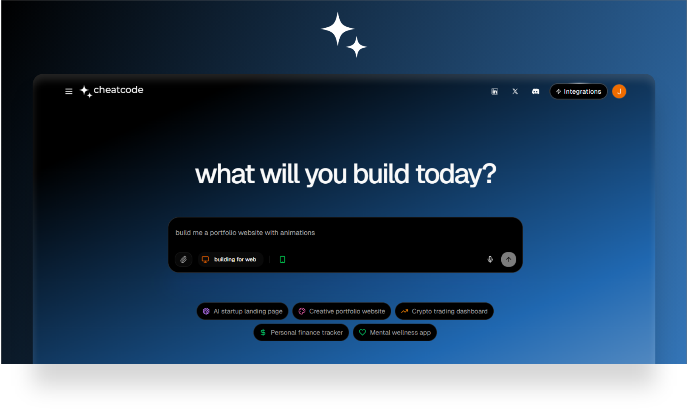
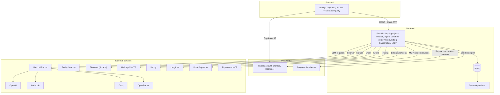

<div align="center">

## cheatcode


An open-source, production-ready AI coding Agent for Apps and Websites.

Build, run, and ship full-stack apps with an agent that codes, executes, deploys, and integrates with your stack.

[](./LICENSE)
[](#backend)
[](#frontend)
[](#database)




</div>

### Table of contents

- [Cheatcode AI — Coding Agent for Apps and Websites](#cheatcode-ai--coding-agent-for-apps-and-websites)
  - [Table of Contents](#table-of-contents-1)
  - [Project Architecture](#project-architecture)
    - [Backend API](#backend-api)
    - [Frontend](#frontend)
    - [Agent Docker](#agent-docker)
    - [Supabase Database](#supabase-database)
  - [Self-Hosting](#self-hosting-1)
    - [Quick Start](#quick-start)
    - [Manual Setup](#manual-setup)
  - [Contributing](#contributing-1)
    - [Technologies](#technologies)

### Overview

Cheatcode is a full-stack application that pairs a Next.js dashboard with a FastAPI backend to provide an AI agent that can:

- Create and modify projects and threads with a collaborative chat UI
- Execute actions inside isolated sandboxes (Daytona), manipulate files, and preview apps
- Integrate with OpenAI/Anthropic/OpenRouter/Groq and other providers via LiteLLM
- Use Supabase for auth, data, and storage; Redis for queues/caching; Dramatiq for workers
- Support browser/crawling via external APIs, and optional billing/usage tracking

The platform is designed to run locally via Docker Compose or be self-hosted on your own infra.

### Architecture

- Backend API (FastAPI, Python 3.11)
  - REST endpoints, thread/project/message management
  - LLM orchestration with LiteLLM/OpenRouter/OpenAI/Anthropic/Groq
  - Async background jobs with Dramatiq and Redis
  - Daytona-powered sandboxes for isolated execution
  - Integrations: Supabase, S3 (boto3), Langfuse, Sentry, Mail
- Worker (Dramatiq)
  - Processes background jobs (agent runs, long tasks)
- Frontend (Next.js 15 + React 18)
  - Auth via Clerk
  - Data via Supabase and backend REST
  - UI: Tailwind CSS v4, shadcn/ui, Radix primitives, Lucide icons
- Redis
  - Caching, queues, and rate-limiting
- Supabase
  - Database, auth, storage, RLS

#### Architecture diagram (Mermaid)



### Complete Tech Stack

## **Frontend Stack**

### **Core Framework & Runtime**
- **Next.js 15.3.1** - React framework with App Router
- **React 18** - Frontend UI library  
- **TypeScript 5** - Type-safe JavaScript
- **Node.js 20** - Runtime environment (Docker)

### **Styling & UI Components**
- **Tailwind CSS 4** - Utility-first CSS framework
- **Radix UI** - Headless UI component library (accordion, dialog, dropdown, etc.)
- **shadcn/ui** - Component system built on Radix UI
- **Lucide React** - Icon library
- **Framer Motion** - Animation library
- **PostCSS** - CSS preprocessing

### **State Management & Data Fetching**
- **TanStack React Query 5.85.3** - Server state management
- **Zustand 5** - Client state management
- **SWR 2.2.5** - Data fetching library

### **Code Editor & Development**
- **CodeMirror 6** - In-browser code editor
- **React CodeMirror** - React integration for CodeMirror
- **Shiki** - Syntax highlighting

### **Authentication & Database**
- **Clerk** - Authentication provider
- **Supabase** - Backend-as-a-Service (database, auth, storage)

### **Development Tools**
- **ESLint 9** - Code linting
- **Prettier 3.5.3** - Code formatting
- **TypeScript 5** - Static type checking

## **Backend Stack**

### **Core Framework & Runtime**
- **Python 3.11** - Programming language
- **FastAPI 0.115.12** - Web framework
- **uvicorn 0.27.1** - ASGI server
- **Gunicorn 23** - WSGI HTTP server for production
- **uv 0.6.5** - Python package manager

### **AI & LLM Integration**
- **LiteLLM 1.72.2** - Unified LLM API interface
- **OpenAI 1.90.0** - OpenAI API client
- **Google GenAI 1.0.0** - Google Gemini API
- **Anthropic** - Claude API integration
- **OpenRouter** - LLM API aggregator
- **Tavily Python 0.5.4** - Web search API

### **Task Queue & Background Processing**
- **Dramatiq 1.18.0** - Task queue system
- **Redis 8-alpine** - Message broker and caching
- **Upstash Redis** - Managed Redis service

### **Database & Storage**
- **Supabase** - PostgreSQL database with real-time features
- **Clerk Backend API** - User management
- **Basejump** - Supabase extensions for multi-tenancy

### **Development Environment & Sandboxing**
- **Daytona SDK** - Cloud development environments
- **MCP (Model Context Protocol)** - Tool integration protocol
- **Docker** - Containerization

### **Payment & Billing**
- **DodoPayments 1.44.0** - Payment processing
- **Stripe** - Payment infrastructure (via DodoPayments)

### **Monitoring & Observability**
- **Sentry SDK** - Error tracking and performance monitoring
- **Langfuse 2.60.5** - LLM observability and analytics
- **Structlog 25.4.0** - Structured logging

### **Integrations & APIs**
- **Pipedream** - Workflow automation platform
- **Mailtrap 2.0.1** - Email testing
- **AWS Boto3** - Amazon Web Services SDK
- **Smithery Registry** - MCP server discovery

### **Security & Utilities**
- **PyJWT 2.10.1** - JSON Web Token handling
- **Cryptography 41** - Cryptographic operations
- **Email Validator** - Email validation
- **Python Multipart** - File upload handling
- **Requests 2.32.3** - HTTP client library
- **HTTPX 0.28.1** - Async HTTP client
- **AIOHTTP 3.12.0** - Async HTTP framework

## **DevOps & Infrastructure**

### **Containerization**
- **Docker** - Container platform
- **Docker Compose** - Multi-container orchestration
- **GitHub Container Registry** - Container image registry

### **Development Tools**
- **mise** - Development environment manager
- **Git** - Version control
- **pnpm** - Node.js package manager (frontend)
- **npm** - Node.js package manager (alternative)

### **Configuration Management**
- **python-dotenv** - Environment variable management
- **TOML** - Configuration file format

### **Cloud Services Integration**
- **Vercel** - Frontend deployment platform
- **Upstash** - Managed Redis
- **Supabase Cloud** - Managed PostgreSQL
- **AWS S3** - Object storage (experimental)
- **Google Cloud** - Cloud services
- **Daytona Cloud** - Development environments

## **Additional Technologies**

### **File Processing**
- **Pillow** - Image processing
- **QRCode** - QR code generation
- **JSZip** - ZIP file handling (frontend)

### **Testing**
- **pytest** - Python testing framework
- **pytest-asyncio** - Async testing support

### **Build Tools**
- **Webpack** - Module bundler (via Next.js)
- **PostCSS** - CSS processing
- **Autoprefixer** - CSS vendor prefixing

### Services & Integrations

- LLM providers: OpenAI, Anthropic, Groq, OpenRouter (via LiteLLM)
- Supabase (DB, Storage, Realtime)
- Clerk (auth)
- Redis (cache/queues)
- Dramatiq (workers)
- Daytona (remote sandboxes for code execution and previews)
- Pipedream MCP (credential profiles and MCP tools)
- DodoPayments (billing hooks) and token-based billing (`backend/services/token_billing.py`)
- Langfuse (tracing), Sentry (error monitoring)
- Tavily (search), Firecrawl (web scraping)
- Email: Mailtrap (via `mailtrap`), SMTP helpers
- Transcription: OpenAI Whisper (see `backend/services/transcription.py`)

### Repository layout

```text
backend/                  # FastAPI service, workers, agents, services, utils
  agent/                  # Agent runtime, tools and prompts
  services/               # Integrations (billing, email, llm, redis, etc.)
  mcp_service/            # Secure MCP endpoints
  sandbox/                # Sandbox APIs and Docker contexts
  deployments/            # Deployment APIs
  utils/                  # Config, logging, auth utils
  main.py                 # FastAPI app entry
  pyproject.toml          # Python dependencies (uv)

frontend/                 # Next.js 15 app
  src/app/                # App Router pages (home, projects, settings, api routes)
  src/components/         # UI components
  src/contexts/           # React contexts
  src/hooks/              # React Query and custom hooks
  src/lib/                # API clients, config, supabase helpers
  src/middleware.ts       # Clerk auth protection
  src/providers/          # App-wide providers
  src/types/              # Shared types
  package.json

docker-compose.yaml       # API, worker, redis, frontend services
```

### Quick start (Docker Compose)

Prerequisites:

- Docker and Docker Compose
- Supabase project (URL + anon + service role keys)
- Clerk application (publishable + secret keys)

1) Create backend environment file `backend/.env`:

```env
# Core
ENV_MODE=local
SUPABASE_URL=YOUR_SUPABASE_URL
SUPABASE_ANON_KEY=YOUR_SUPABASE_ANON_KEY
SUPABASE_SERVICE_ROLE_KEY=YOUR_SUPABASE_SERVICE_ROLE_KEY

# Auth
CLERK_SECRET_KEY=YOUR_CLERK_SECRET_KEY

# Redis (compose uses service name `redis`)
# For Docker Compose, point to the service hostname
REDIS_URL=redis://redis:6379
# Optional: Only if using Upstash REST (leave empty locally)
UPSTASH_REDIS_REST_URL=
UPSTASH_REDIS_REST_TOKEN=

# Models (choose at least one)
OPENAI_API_KEY=...
ANTHROPIC_API_KEY=...
OPENROUTER_API_KEY=...

# Optional integrations
DAYTONA_API_KEY=...
DAYTONA_SERVER_URL=...
DAYTONA_TARGET=...
TAVILY_API_KEY=...
FIRECRAWL_API_KEY=...
LANGFUSE_PUBLIC_KEY=...
LANGFUSE_SECRET_KEY=...
```

2) Create frontend environment file `frontend/.env.local`:

```env
NEXT_PUBLIC_BACKEND_URL=http://localhost:8000

NEXT_PUBLIC_SUPABASE_URL=YOUR_SUPABASE_URL
NEXT_PUBLIC_SUPABASE_ANON_KEY=YOUR_SUPABASE_ANON_KEY

NEXT_PUBLIC_APP_URL=http://localhost:3000
NEXT_PUBLIC_URL=http://localhost:3000

# Clerk
NEXT_PUBLIC_CLERK_PUBLISHABLE_KEY=YOUR_CLERK_PUBLISHABLE_KEY

# Optional flags/telemetry
NEXT_PUBLIC_FEATURE_FLAGS_ENABLED=false
EDGE_CONFIG= # if using Vercel Edge Config
```

3) Start the stack:

```bash
docker compose up --build
```

Services:

- Frontend: http://localhost:3000
- API: http://localhost:8000 (health: `/api/health`)
- Redis: localhost:6379

### Environment variables

Backend (`backend/.env`) — key variables loaded by `utils/config.py`:

- Core: `ENV_MODE`, `SUPABASE_URL`, `SUPABASE_ANON_KEY`, `SUPABASE_SERVICE_ROLE_KEY`
- Auth: `CLERK_SECRET_KEY`, `ADMIN_API_KEY`
- Models: `OPENAI_API_KEY`, `ANTHROPIC_API_KEY`, `GROQ_API_KEY`, `OPENROUTER_API_KEY`, `MODEL_TO_USE`
- Redis: `UPSTASH_REDIS_REST_URL`, `UPSTASH_REDIS_REST_TOKEN`, `REDIS_URL` (use `redis://redis:6379` when running via Docker Compose)
- Daytona: `DAYTONA_API_KEY`, `DAYTONA_SERVER_URL`, `DAYTONA_TARGET`
- Search & crawl: `TAVILY_API_KEY`, `FIRECRAWL_API_KEY`, `FIRECRAWL_URL`, `RAPID_API_KEY`, `CLOUDFLARE_API_TOKEN`
- Observability: `LANGFUSE_PUBLIC_KEY`, `LANGFUSE_SECRET_KEY`, `LANGFUSE_HOST`, `SENTRY_DSN`
- Payments (optional): `DODO_PAYMENTS_API_KEY`, `DODO_PAYMENTS_WEBHOOK_SECRET`

Frontend (`frontend/.env.local`):

- Backend: `NEXT_PUBLIC_BACKEND_URL`
- Supabase: `NEXT_PUBLIC_SUPABASE_URL`, `NEXT_PUBLIC_SUPABASE_ANON_KEY`
- App URLs: `NEXT_PUBLIC_APP_URL`, `NEXT_PUBLIC_URL`
- Clerk: `NEXT_PUBLIC_CLERK_PUBLISHABLE_KEY`
- Optional flags/telemetry: `NEXT_PUBLIC_FEATURE_FLAGS_ENABLED`, `EDGE_CONFIG`, `NEXT_PUBLIC_SENTRY_DSN`

### Local development (without Docker)

Backend:

```bash
cd backend
uv sync  # requires uv (https://github.com/astral-sh/uv)
uv run uvicorn main:app --reload --host 0.0.0.0 --port 8000
```

Worker:

```bash
cd backend
uv run dramatiq --skip-logging --processes 1 --threads 2 run_agent_background
```

Frontend:

```bash
cd frontend
npm install
npm run dev
```
### First run checklist

Use this to verify a clean first run:

1) __Backend env (`backend/.env`)__
   - `ENV_MODE=local`
   - Set `SUPABASE_URL`, `SUPABASE_ANON_KEY`, `SUPABASE_SERVICE_ROLE_KEY`
   - Set `CLERK_SECRET_KEY`
   - Provide at least one model key: `OPENAI_API_KEY` or `ANTHROPIC_API_KEY` or `OPENROUTER_API_KEY`
   - If using Docker Compose: `REDIS_URL=redis://redis:6379`

2) __Frontend env (`frontend/.env.local`)__
   - `NEXT_PUBLIC_BACKEND_URL=http://localhost:8000`
   - `NEXT_PUBLIC_SUPABASE_URL` and `NEXT_PUBLIC_SUPABASE_ANON_KEY`
   - `NEXT_PUBLIC_APP_URL` and `NEXT_PUBLIC_URL` = `http://localhost:3000`
   - `NEXT_PUBLIC_CLERK_PUBLISHABLE_KEY`

3) __Database (Supabase)__
   - Ensure required tables exist (e.g., `projects`, `threads`, `messages`, `agent_runs`, `accounts`)
   - For local dev, verify RLS isn’t blocking your user for basic reads/writes

4) __Start services__
   - Run: `docker compose up --build`
   - Wait until API reports healthy

5) __Verify locally__
   - API health: open `http://localhost:8000/api/health` (expect `{ "status": "ok" }`)
   - Frontend: open `http://localhost:3000`, sign in with Clerk
   - Create a project, open a thread, send a message, start the agent

6) __Troubleshooting quick tips__
   - Agent fails: check model keys in `backend/.env`
   - 401s: verify Clerk keys and [frontend/src/middleware.ts](cci:7://file:///c:/Users/USER/Desktop/deployment-cheatcode/frontend/src/middleware.ts:0:0-0:0)
   - CORS: confirm `NEXT_PUBLIC_BACKEND_URL` and `allowed_origins` in [backend/main.py](cci:7://file:///c:/Users/USER/Desktop/deployment-cheatcode/backend/main.py:0:0-0:0)
   - Queues: ensure Redis healthy and `worker` service running
   
### Self-hosting

This app runs anywhere Docker is available. Use the compose file for a production-like setup, or run services manually for development.

Prerequisites:

- A Supabase project (URL, anon, service role keys)
- A Clerk application (publishable key for the frontend, secret key for the backend)
- Optional: Daytona account + API key to enable sandbox code execution and app previews

1) Backend configuration (required)

- Create `backend/.env` using the example in Quick start. Important:
  - Set `ENV_MODE=local` when running locally to enable CORS for `http://localhost:3000`
  - Provide Supabase URL and keys
  - Provide at least one model provider key (OpenAI/Anthropic/OpenRouter/Groq)
  - If using Daytona sandboxes, set `DAYTONA_*` variables
  - If using Sentry/Langfuse, add their keys as well

2) Frontend configuration (required)

- Create `frontend/.env.local` using the example in Quick start. Important:
  - `NEXT_PUBLIC_BACKEND_URL` must point at your backend (`http://localhost:8000` locally)
  - `NEXT_PUBLIC_SUPABASE_URL` and `NEXT_PUBLIC_SUPABASE_ANON_KEY` must match your Supabase project
  - `NEXT_PUBLIC_CLERK_PUBLISHABLE_KEY` must match your Clerk app

3) Database (Supabase)

- The application uses Supabase tables such as `projects`, `threads`, `messages`, `agent_runs`, and `accounts`;
  ensure these exist in your project. If you are migrating from a blank project, create tables to match your app needs.
  The frontend and backend access Supabase via the keys you configure.

4) Start services

```bash
docker compose up --build -d
```

Default ports:

- Frontend: `http://localhost:3000`
- Backend: `http://localhost:8000` (health: `GET /api/health`)
- Redis: `localhost:6379`

5) Production deployment

- Provision a VM (or use any Docker host) and run the same compose file
- Set `ENV_MODE=production` in `backend/.env`
- Update DNS and TLS (e.g., behind Nginx/Traefik/Caddy) to expose ports 80/443
- Important: CORS in `backend/main.py` allows `trycheatcode.com` and `localhost:3000` by default; if you deploy on your own domain, add it to `allowed_origins` or extend configuration accordingly

6) Authentication & protected routes

- Clerk middleware in `frontend/src/middleware.ts` protects `/agents`, `/projects`, and `/settings`
- Backend endpoints expect a Bearer token from Clerk on authenticated routes
- Supabase is used for data storage; the Clerk token bridges auth between the frontend and backend

7) Observability & billing (optional)

- Sentry and Langfuse are integrated in the backend; provide their keys to enable telemetry
- DodoPayments webhook routes are included for billing, and a token-based metering system exists under `backend/services/token_billing.py`

8) Sandboxes & app previews (optional)

- Daytona integration powers isolated execution and preview links
- Provide `DAYTONA_API_KEY`, `DAYTONA_SERVER_URL`, and `DAYTONA_TARGET` to enable runtime features

### API overview

Key backend endpoints (prefix `/api`):

- Health: `GET /health`
- Projects/Threads: `GET /projects`, `POST /projects`, `GET /projects/{project_id}`, `GET /threads`, `POST /threads`
- Agent runs: `POST /thread/{thread_id}/agent/start`, `GET /agent-run/{agent_run_id}/status`, `POST /agent-run/{agent_run_id}/stop`, `GET /thread/{thread_id}/agent-runs`
- Sandboxes: `POST /project/{project_id}/sandbox/ensure-active`, `POST /sandboxes/{sandbox_id}/files`, `GET /sandboxes/{sandbox_id}/files`, `GET /sandboxes/{sandbox_id}/files/content`, `POST /sandboxes/{sandbox_id}/execute`, `GET /sandboxes/{sandbox_id}/sessions/{session_name}/status`, `GET /sandboxes/{sandbox_id}/preview-url`
- Deployments: `POST /project/{project_id}/deploy/git`, `POST /project/{project_id}/deploy/git/update`, `GET /project/{project_id}/deployment/status`, `GET /project/{project_id}/git/files`, `GET /project/{project_id}/git/file-content`
- Billing: `GET /billing/status`, `GET /billing/subscription`, `GET /billing/usage-history`, `GET /billing/plans`, `POST /billing/create-checkout-session`, `POST /billing/upgrade-plan`
- Pipedream/MCP: profiles, connections, discovery under `/pipedream/*` and `/secure-mcp/*`

### Troubleshooting

- API health: `GET http://localhost:8000/api/health`
- Redis connectivity: ensure compose `redis` is healthy and reachable from `api` and `worker`
- 401s on protected routes: verify Clerk keys and middleware configuration in `frontend/src/middleware.ts`
- Missing data in frontend: ensure `NEXT_PUBLIC_BACKEND_URL`, Supabase envs, and CORS on backend
 - Custom domain CORS: add your domain to `allowed_origins` in `backend/main.py`

### Contributing

Contributions, issues, and feature requests are welcome. Please open an issue or PR.

### License

Apache 2.0  Cheatcode AI. See [`LICENSE`](./LICENSE).

—

Built by [Jigyansu Rout](https://jigyansurout.com/)