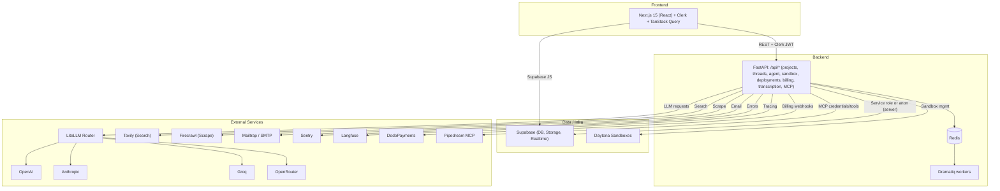

<div align="center">

## Cheatcode AI

An open-source, production-ready AI coding and automation platform.

Build, run, and ship full-stack apps with an agent that codes, executes, deploys, and integrates with your stack.

[](./LICENSE)
[](#backend)
[](#frontend)
[](#database)

</div>

### Table of contents

- [Cheatcode AI — Coding Agent for Apps and Websites](#cheatcode-ai--coding-agent-for-apps-and-websites)
  - [Table of Contents](#table-of-contents-1)
  - [Project Architecture](#project-architecture)
    - [Backend API](#backend-api)
    - [Frontend](#frontend)
    - [Agent Docker](#agent-docker)
    - [Supabase Database](#supabase-database)
  - [Self-Hosting](#self-hosting-1)
    - [Quick Start](#quick-start)
    - [Manual Setup](#manual-setup)
  - [Contributing](#contributing-1)
    - [Technologies](#technologies)

### Overview

Cheatcode is a full-stack application that pairs a Next.js dashboard with a FastAPI backend to provide an AI agent that can:

- Create and modify projects and threads with a collaborative chat UI
- Execute actions inside isolated sandboxes (Daytona), manipulate files, and preview apps
- Integrate with OpenAI/Anthropic/OpenRouter/Groq and other providers via LiteLLM
- Use Supabase for auth, data, and storage; Redis for queues/caching; Dramatiq for workers
- Support browser/crawling via external APIs, and optional billing/usage tracking

The platform is designed to run locally via Docker Compose or be self-hosted on your own infra.

### Architecture


- Backend API (FastAPI, Python 3.11)
  - REST endpoints, thread/project/message management
  - LLM orchestration with LiteLLM/OpenRouter/OpenAI/Anthropic/Groq
  - Async background jobs with Dramatiq and Redis
  - Daytona-powered sandboxes for isolated execution
  - Integrations: Supabase, S3 (boto3), Langfuse, Sentry, Mail
- Worker (Dramatiq)
  - Processes background jobs (agent runs, long tasks)
- Frontend (Next.js 15 + React 18)
  - Auth via Clerk
  - Data via Supabase and backend REST
  - UI: Tailwind CSS v4, shadcn/ui, Radix primitives, Lucide icons
- Redis
  - Caching, queues, and rate-limiting
- Supabase
  - Database, auth, storage, RLS

#### Architecture diagram (Mermaid)



### Tech stack

- Backend: Python 3.11, FastAPI, Uvicorn/Gunicorn, Dramatiq, Redis, httpx, aiohttp, boto3, Sentry, Langfuse
- Model routing: LiteLLM, OpenRouter, OpenAI, Anthropic, Groq, Google GenAI
- Frontend: Next.js 15, React 18, Tailwind v4, shadcn/ui, Radix UI, TanStack Query, Zustand
- Auth: Clerk
- Data: Supabase (DB + storage)
- Job/workers: Dramatiq + Redis
- Sandbox: Daytona SDK (remote container workspaces)

### Services & Integrations

- LLM providers: OpenAI, Anthropic, Groq, OpenRouter (via LiteLLM)
- Supabase (DB, Storage, Realtime)
- Clerk (auth)
- Redis (cache/queues)
- Dramatiq (workers)
- Daytona (remote sandboxes for code execution and previews)
- Pipedream MCP (credential profiles and MCP tools)
- DodoPayments (billing hooks) and token-based billing (`backend/services/token_billing.py`)
- Langfuse (tracing), Sentry (error monitoring)
- Tavily (search), Firecrawl (web scraping)
- Email: Mailtrap (via `mailtrap`), SMTP helpers
- Transcription: OpenAI Whisper (see `backend/services/transcription.py`)

### Repository layout

```text
backend/                  # FastAPI service, workers, agents, services, utils
  agent/                  # Agent runtime, tools and prompts
  services/               # Integrations (billing, email, llm, redis, etc.)
  mcp_service/            # Secure MCP endpoints
  sandbox/                # Sandbox APIs and Docker contexts
  deployments/            # Deployment APIs
  utils/                  # Config, logging, auth utils
  main.py                 # FastAPI app entry
  pyproject.toml          # Python dependencies (uv)

frontend/                 # Next.js 15 app
  src/app/                # App Router pages (home, projects, settings, api routes)
  src/components/         # UI components
  src/hooks/              # React Query and custom hooks
  src/lib/                # API clients, config, supabase helpers
  middleware.ts           # Clerk auth protection
  package.json

templates/                # App and mobile templates scaffolded by the agent
docs/                     # Self-hosting and integration docs
docker-compose.yaml       # API, worker, redis, frontend services
```

### Quick start (Docker Compose)

Prerequisites:

- Docker and Docker Compose
- Supabase project (URL + anon + service role keys)
- Clerk application (publishable + secret keys)

1) Create backend environment file `backend/.env`:

```env
# Core
ENV_MODE=local
SUPABASE_URL=YOUR_SUPABASE_URL
SUPABASE_ANON_KEY=YOUR_SUPABASE_ANON_KEY
SUPABASE_SERVICE_ROLE_KEY=YOUR_SUPABASE_SERVICE_ROLE_KEY

# Auth
CLERK_SECRET_KEY=YOUR_CLERK_SECRET_KEY

# Redis (compose uses service name `redis`)
# For local development, use local Redis
UPSTASH_REDIS_REST_URL=http://localhost:8080
UPSTASH_REDIS_REST_TOKEN=local-token
REDIS_URL=redis://localhost:6379

# Models (choose at least one)
OPENAI_API_KEY=...
ANTHROPIC_API_KEY=...
OPENROUTER_API_KEY=...

# Optional integrations
DAYTONA_API_KEY=...
DAYTONA_SERVER_URL=...
DAYTONA_TARGET=...
TAVILY_API_KEY=...
FIRECRAWL_API_KEY=...
LANGFUSE_PUBLIC_KEY=...
LANGFUSE_SECRET_KEY=...
```

2) Create frontend environment file `frontend/.env.local`:

```env
NEXT_PUBLIC_BACKEND_URL=http://localhost:8000
BACKEND_URL=http://localhost:8000

NEXT_PUBLIC_SUPABASE_URL=YOUR_SUPABASE_URL
NEXT_PUBLIC_SUPABASE_ANON_KEY=YOUR_SUPABASE_ANON_KEY

NEXT_PUBLIC_APP_URL=http://localhost:3000
NEXT_PUBLIC_URL=http://localhost:3000

# Clerk
NEXT_PUBLIC_CLERK_PUBLISHABLE_KEY=YOUR_CLERK_PUBLISHABLE_KEY

# Optional
NEXT_PUBLIC_FEATURE_FLAGS_ENABLED=false
EDGE_CONFIG= # if using Vercel Edge Config
```

3) Start the stack:

```bash
docker compose up --build
```

Services:

- Frontend: http://localhost:3000
- API: http://localhost:8000 (health: `/api/health`)
- Redis: localhost:6379

### Environment variables

Backend (`backend/.env`) — key variables loaded by `utils/config.py`:

- Core: `ENV_MODE`, `SUPABASE_URL`, `SUPABASE_ANON_KEY`, `SUPABASE_SERVICE_ROLE_KEY`
- Auth: `CLERK_SECRET_KEY`, `ADMIN_API_KEY`
- Models: `OPENAI_API_KEY`, `ANTHROPIC_API_KEY`, `GROQ_API_KEY`, `OPENROUTER_API_KEY`, `MODEL_TO_USE`
- Redis: `UPSTASH_REDIS_REST_URL`, `UPSTASH_REDIS_REST_TOKEN`, `REDIS_URL`
- Daytona: `DAYTONA_API_KEY`, `DAYTONA_SERVER_URL`, `DAYTONA_TARGET`
- Search & crawl: `TAVILY_API_KEY`, `FIRECRAWL_API_KEY`, `FIRECRAWL_URL`, `RAPID_API_KEY`, `CLOUDFLARE_API_TOKEN`
- Observability: `LANGFUSE_PUBLIC_KEY`, `LANGFUSE_SECRET_KEY`, `LANGFUSE_HOST`, `SENTRY_DSN`
- Payments (optional): `DODO_PAYMENTS_API_KEY`, `DODO_PAYMENTS_WEBHOOK_SECRET`

Frontend (`frontend/.env.local`):

- Backend: `NEXT_PUBLIC_BACKEND_URL`, `BACKEND_URL`
- Supabase: `NEXT_PUBLIC_SUPABASE_URL`, `NEXT_PUBLIC_SUPABASE_ANON_KEY`
- App URLs: `NEXT_PUBLIC_APP_URL`, `NEXT_PUBLIC_URL`
- Clerk: `NEXT_PUBLIC_CLERK_PUBLISHABLE_KEY`
- Optional flags/telemetry: `NEXT_PUBLIC_FEATURE_FLAGS_ENABLED`, `EDGE_CONFIG`, `NEXT_PUBLIC_SENTRY_DSN`

### Local development (without Docker)

Backend:

```bash
cd backend
uv sync  # requires uv (https://github.com/astral-sh/uv)
uv run uvicorn main:app --reload --host 0.0.0.0 --port 8000
```

Worker:

```bash
cd backend
uv run dramatiq --processes 2 --threads 2 run_agent_background
```

Frontend:

```bash
cd frontend
npm install
npm run dev
```

### Self-hosting

This app runs anywhere Docker is available. Use the compose file for a production-like setup, or run services manually for development.

Prerequisites:

- A Supabase project (URL, anon, service role keys)
- A Clerk application (publishable key for the frontend, secret key for the backend)
- Optional: Daytona account + API key to enable sandbox code execution and app previews

1) Backend configuration (required)

- Create `backend/.env` using the example in Quick start. Important:
  - Set `ENV_MODE=local` when running locally to enable CORS for `http://localhost:3000`
  - Provide Supabase URL and keys
  - Provide at least one model provider key (OpenAI/Anthropic/OpenRouter/Groq)
  - If using Daytona sandboxes, set `DAYTONA_*` variables
  - If using Sentry/Langfuse, add their keys as well

2) Frontend configuration (required)

- Create `frontend/.env.local` using the example in Quick start. Important:
  - `NEXT_PUBLIC_BACKEND_URL` must point at your backend (`http://localhost:8000` locally)
  - `NEXT_PUBLIC_SUPABASE_URL` and `NEXT_PUBLIC_SUPABASE_ANON_KEY` must match your Supabase project
  - `NEXT_PUBLIC_CLERK_PUBLISHABLE_KEY` must match your Clerk app

3) Database (Supabase)

- The application uses Supabase tables such as `projects`, `threads`, `messages`, `agent_runs`, and `accounts`;
  ensure these exist in your project. If you are migrating from a blank project, create tables to match your app needs.
  The frontend and backend access Supabase via the keys you configure.

4) Start services

```bash
docker compose up --build -d
```

Default ports:

- Frontend: `http://localhost:3000`
- Backend: `http://localhost:8000` (health: `GET /api/health`)
- Redis: `localhost:6379`

5) Production deployment

- Provision a VM (or use any Docker host) and run the same compose file
- Set `ENV_MODE=production` in `backend/.env`
- Update DNS and TLS (e.g., behind Nginx/Traefik/Caddy) to expose ports 80/443
- Important: CORS in `backend/main.py` allows `trycheatcode.com` and `localhost:3000` by default; if you deploy on your own domain, add it to `allowed_origins` or extend configuration accordingly

6) Authentication & protected routes

- Clerk middleware in `frontend/src/middleware.ts` protects `/agents`, `/projects`, and `/settings`
- Backend endpoints expect a Bearer token from Clerk on authenticated routes
- Supabase is used for data storage; the Clerk token bridges auth between the frontend and backend

7) Observability & billing (optional)

- Sentry and Langfuse are integrated in the backend; provide their keys to enable telemetry
- DodoPayments webhook routes are included for billing, and a token-based metering system exists under `backend/services/token_billing.py`

8) Sandboxes & app previews (optional)

- Daytona integration powers isolated execution and preview links
- Provide `DAYTONA_API_KEY`, `DAYTONA_SERVER_URL`, and `DAYTONA_TARGET` to enable runtime features

### API overview

Key backend endpoints (prefix `/api`):

- Health: `GET /health`
- Projects/Threads: `GET /projects`, `POST /projects`, `GET /projects/{project_id}`, `GET /threads`, `POST /threads`
- Agent runs: `POST /thread/{thread_id}/agent/start`, `GET /agent-run/{agent_run_id}/status`, `POST /agent-run/{agent_run_id}/stop`, `GET /thread/{thread_id}/agent-runs`
- Sandboxes: `POST /project/{project_id}/sandbox/ensure-active`, `POST /sandboxes/{sandbox_id}/files`, `GET /sandboxes/{sandbox_id}/files`, `GET /sandboxes/{sandbox_id}/files/content`, `POST /sandboxes/{sandbox_id}/execute`, `GET /sandboxes/{sandbox_id}/sessions/{session_name}/status`, `GET /sandboxes/{sandbox_id}/preview-url`
- Deployments: `POST /project/{project_id}/deploy/git`, `POST /project/{project_id}/deploy/git/update`, `GET /project/{project_id}/deployment/status`, `GET /project/{project_id}/git/files`, `GET /project/{project_id}/git/file-content`
- Billing: `GET /billing/status`, `GET /billing/subscription`, `GET /billing/usage-history`, `GET /billing/plans`, `POST /billing/create-checkout-session`, `POST /billing/upgrade-plan`
- Pipedream/MCP: profiles, connections, discovery under `/pipedream/*` and `/secure-mcp/*`

### Troubleshooting

- API health: `GET http://localhost:8000/api/health`
- Redis connectivity: ensure compose `redis` is healthy and reachable from `api` and `worker`
- 401s on protected routes: verify Clerk keys and middleware configuration in `frontend/src/middleware.ts`
- Missing data in frontend: ensure `NEXT_PUBLIC_BACKEND_URL`, Supabase envs, and CORS on backend
 - Custom domain CORS: add your domain to `allowed_origins` in `backend/main.py`

### Contributing

Contributions, issues, and feature requests are welcome. Please open an issue or PR.

### License

Apache 2.0 © Cheatcode AI. See [`LICENSE`](./LICENSE).

—

Built by [Jigyansu Rout](https://jigyansurout.com/)

<div align="center">

# Cheatcode AI — Coding Agent for Apps and Websites

(that acts on your behalf)


CheatCode is a fully open source AI assistant that helps you accomplish real-world tasks with ease. Through natural conversation, CheatCode becomes your digital companion for research, data analysis, and everyday challenges—combining powerful capabilities with an intuitive interface that understands what you need and delivers results.

CheatCode's powerful toolkit includes seamless browser automation to navigate the web and extract data, file management for document creation and editing, web crawling and extended search capabilities, command-line execution for system tasks, website deployment, and integration with various APIs and services. These capabilities work together harmoniously, allowing CheatCode to solve your complex problems and automate workflows through simple conversations!

[](./license)
[](https://discord.gg/s3y5bUKUEF)
[](https://x.com/trycheatcode)
[](https://github.com/cheatcode-ai/cheatcode)
[](https://github.com/cheatcode-ai/cheatcode/labels/bug)

<!-- Keep these links. Translations will automatically update with the README. -->
<!-- Omitted external language links that referenced another product -->

</div>

## Table of Contents

- [Cheatcode AI — Coding Agent for Apps and Websites](#cheatcode-ai--coding-agent-for-apps-and-websites)
  - [Table of Contents](#table-of-contents-1)
  - [Project Architecture](#project-architecture)
    - [Backend API](#backend-api)
    - [Frontend](#frontend)
    - [Agent Docker](#agent-docker)
    - [Supabase Database](#supabase-database)
  - [Self-Hosting](#self-hosting-1)
    - [Quick Start](#quick-start)
    - [Manual Setup](#manual-setup)
  - [Contributing](#contributing-1)
    - [Technologies](#technologies)

## Project Architecture


CheatCode consists of four main components:

### Backend API

Python/FastAPI service that handles REST endpoints, thread management, and LLM integration with Anthropic, and others via LiteLLM.

### Frontend

Next.js/React application providing a responsive UI with chat interface, dashboard, etc.

### Agent Docker

Isolated execution environment for every agent - with browser automation, code interpreter, file system access, tool integration, and security features.

### Supabase Database

Handles data persistence with authentication, user management, conversation history, file storage, agent state, analytics, and real-time subscriptions.


## Self-Hosting

Cheatcode AI can be self-hosted on your own infrastructure. See the self-hosting section above.

The setup process includes:

- Setting up a Supabase project for database and authentication
- Configuring Redis for caching and session management
- Setting up Daytona for secure agent execution
- Integrating with LLM providers (Anthropic, OpenAI, OpenRouter, etc.)
- Configuring web search and scraping capabilities (Tavily, Firecrawl)
- Setting up QStash for background job processing and workflows
- Configuring webhook handling for automated tasks
- Optional integrations (RapidAPI, Smithery for custom agents)

### Quick Start

1. **Clone the repository**:

```bash
git clone https://github.com/cheatcode-ai/cheatcode.git
cd cheatcode
```

2. Start or stop containers with Docker Compose:

```bash
docker compose up --build -d
# docker compose down
```

### Manual Setup

Detailed self-hosting steps are documented in this README under the Self-hosting section.

For detailed instructions, troubleshooting tips, and advanced configuration options, see the self-hosting and troubleshooting sections above.

## Contributing

Contributions, issues, and feature requests are welcome. Open a pull request with a clear description and scope, or file an issue with reproduction steps.


### Technologies

- [Daytona](https://daytona.io/) - Secure agent execution environment
- [Supabase](https://supabase.com/) - Database and authentication
- [OpenAI](https://openai.com/) - LLM provider
- [Anthropic](https://www.anthropic.com/) - LLM provider
- [Tavily](https://tavily.com/) - Search capabilities
- [Firecrawl](https://firecrawl.dev/) - Web scraping capabilities
- [RapidAPI](https://rapidapi.com/) - API services
- [Smithery](https://smithery.ai/) - Custom agent development

