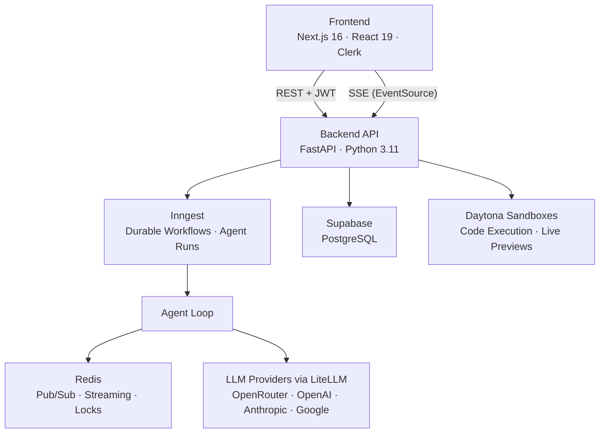

<div align="center">


# Cheatcode

**Open-source AI coding agent that builds, runs, and ships full-stack applications.**

Describe what you want. Cheatcode writes the code, executes it in a sandbox, shows you a live preview, and deploys it -- all from a single chat interface.

[](./LICENSE-Apache-2.0)
[](https://www.python.org/downloads/)
[](https://www.typescriptlang.org/)
[](https://fastapi.tiangolo.com/)
[](https://nextjs.org/)
[](./CONTRIBUTING.md)

[Website](https://trycheatcode.com) | [Report Bug](https://github.com/cheatcode-ai/cheatcode/issues) | [Request Feature](https://github.com/cheatcode-ai/cheatcode/issues)

</div>

---

## What is Cheatcode?

Cheatcode is a production-ready AI coding agent with a chat-based interface. You describe what you want to build, and the agent writes code, runs commands, takes screenshots, searches the web, and iterates -- all inside an isolated sandbox with a live preview of your app.

**Key capabilities:**

- **Build apps through conversation** -- Chat with an AI agent that writes, edits, and runs code in real-time
- **Live preview** -- See your web or mobile (Expo) app update live as the agent works
- **Sandboxed execution** -- All code runs in isolated Daytona sandboxes, not on your machine
- **100+ LLM models** -- Use Gemini, Claude, GPT, Grok, Llama, and more via OpenRouter
- **13 built-in tools** -- File editing, shell commands, grep, screenshots, vision analysis, LSP, web search, and more
- **One-click deploy** -- Ship to Vercel directly from the interface
- **Third-party integrations** -- Connect GitHub, Slack, Gmail, Notion via Composio MCP
- **Bring Your Own Key** -- Use your own OpenRouter API key for unlimited usage
- **Self-hostable** -- Run the entire stack on your own infrastructure with Docker Compose

## Architecture


```mermaid
flowchart TD
    FE["Frontend\nNext.js 16 &middot; React 19 &middot; Clerk"]
    BE["Backend API\nFastAPI &middot; Python 3.11"]
    AGENT["Agent Loop"]
    INNGEST["Inngest\nDurable Workflows &middot; Agent Runs"]
    REDIS["Redis\nPub/Sub &middot; Streaming &middot; Locks"]
    DB["Supabase\nPostgreSQL"]
    SANDBOX["Daytona Sandboxes\nCode Execution &middot; Live Previews"]
    LLM["LLM Providers via LiteLLM\nOpenRouter &middot; OpenAI &middot; Anthropic &middot; Google"]

    FE -- "REST + JWT" --> BE
    FE -- "SSE (EventSource)" --> BE
    BE --> INNGEST
    INNGEST --> AGENT
    AGENT --> REDIS
    BE --> DB
    BE --> SANDBOX
    AGENT --> LLM
```

| Component | Technology | Role |
|-----------|-----------|------|
| **Backend API** | FastAPI, Python 3.11 | REST endpoints, agent orchestration, LLM calls |
| **Durable Workflows** | Inngest | Agent execution, deployments, webhooks, retryable workflows |
| **Frontend** | Next.js 16, React 19 | Chat UI, auth (Clerk), real-time streaming |
| **Cache / PubSub** | Redis | Response streaming, distributed locks, caching |
| **Database** | Supabase (PostgreSQL) | Persistent storage with Row Level Security |
| **Sandboxes** | Daytona SDK | Isolated code execution with live web & mobile previews |

## Agent Tools

The agent has 13 tools it can use autonomously during a conversation:

| Tool | What it does |
|------|-------------|
| **Shell** | Execute commands in the sandbox (install deps, run scripts, start servers) |
| **Files** | Read, write, delete, copy, and move files and directories |
| **Grep** | Full-text search and semantic (embedding-based) search across files |
| **Screenshot** | Capture browser screenshots of the running app |
| **Vision** | AI-powered analysis of screenshots for visual debugging |
| **LSP** | Find definitions, references, and hover info via Language Server Protocol |
| **Web Search** | Search the web via Tavily for docs, libraries, and best practices |
| **Components** | Embedding-based component discovery for code reuse |
| **MCP Wrapper** | Dynamic integration with GitHub, Slack, Gmail, Notion via Composio |
| **Completion** | Signal task completion and gracefully stop the agent loop |

## Getting Started

### Prerequisites

| Requirement | Minimum | Notes |
|-------------|---------|-------|
| **Docker** | 24.0+ | With Docker Compose 2.0+ |
| **RAM** | 4 GB | 8 GB recommended |
| **Disk** | 2 GB | For Docker images |
| **OS** | Linux, macOS, Windows (WSL2) | |

For local development without Docker, you also need:
- [Node.js 20+](https://nodejs.org/)
- [Python 3.11+](https://www.python.org/)
- [uv](https://github.com/astral-sh/uv) (Python package manager)

### Required Accounts

You will need API keys from these services:

| Service | What for | Get it at |
|---------|----------|-----------|
| **Supabase** | Database (PostgreSQL) | [supabase.com](https://supabase.com) |
| **OpenRouter** (or OpenAI / Anthropic) | LLM provider (at least one) | [openrouter.ai](https://openrouter.ai) |
| **Daytona** | Sandboxed code execution | [daytona.io](https://daytona.io) |
| **Relace** | Fast inline code edits | [relace.ai](https://relace.ai) |

<details>
<summary><strong>Optional integrations</strong></summary>

| Service | What for |
|---------|----------|
| **Clerk** | Authentication (user sign-in/sign-up) |
| **Tavily** | Web search for the agent |
| **Vercel** | One-click deployment of user projects |
| **Composio** | Third-party app integrations (GitHub, Slack, Gmail, Notion) |
| **Polar.sh** | Billing and subscription management |
| **Firecrawl** | Web scraping |
| **Langfuse** | LLM observability and tracing |
| **Sentry** | Error monitoring |

</details>

### Quick Start (Docker)

**1. Clone and set up environment**

```bash
git clone https://github.com/cheatcode-ai/cheatcode.git
cd cheatcode

# Copy environment templates
cp backend/.env.example backend/.env
cp frontend/.env.example frontend/.env
```

> You can also run `./scripts/setup.sh` to check prerequisites and copy env files automatically.

**2. Fill in your API keys**

Edit `backend/.env` and `frontend/.env` with your API keys. At minimum, you need the values listed in [Required Accounts](#required-accounts).

<details>
<summary><strong>All optional backend variables</strong></summary>

See `backend/.env.example` for the full list of optional variables including:
- Clerk (authentication)
- Tavily (web search)
- Firecrawl (web scraping)
- Vercel (deployments)
- Composio (third-party integrations)
- Langfuse (observability)
- Sentry (error tracking)
- Polar (billing)
- Inngest (durable workflows)

</details>

**3. Start everything**

```bash
docker compose -f docker-compose.dev.yml up --build
```

**4. Open the app**

| Service | URL |
|---------|-----|
| Frontend | http://localhost:3000 |
| Backend API | http://localhost:8000 |
| Health check | http://localhost:8000/api/health |
| Inngest dashboard | http://localhost:8288 |

Sign in with Clerk, create a project, start a thread, and send your first message.

## Local Development (Without Docker)

If you prefer running services directly on your machine:

### Backend

```bash
cd backend

# Install dependencies
uv sync

# Copy env file if you haven't already
cp .env.example .env
# Edit .env with your API keys

# Start the API server (with hot reload)
uv run uvicorn main:app --reload --host 0.0.0.0 --port 8000
```

> **Note:** You'll need a Redis instance running locally or via Upstash. Update `REDIS_URL` in `backend/.env` accordingly. For local Redis: `redis://localhost:6379`.

### Frontend

```bash
cd frontend

# Install dependencies
npm install

# Copy env file if you haven't already
cp .env.example .env
# Edit .env with your keys

# Start the dev server (Turbopack)
npm run dev
```

The frontend runs at http://localhost:3000.

### Docker Compose (Development Mode)

For hot-reload on both backend and frontend with Docker:

```bash
docker compose -f docker-compose.dev.yml up
```

This starts:
- **Backend** on port 8000 -- uvicorn with `--reload`
- **Frontend** on port 3000 -- Next.js dev with Turbopack
- **Inngest dev server** on port 8288
- **Redis** on port 6380

## Project Structure

```
cheatcode/
├── backend/                        # Python FastAPI backend
│   ├── main.py                     # App entry point
│   ├── agent/                      # Agent runtime
│   │   ├── run.py                  # Agent execution loop
│   │   ├── api.py                  # Agent REST endpoints
│   │   ├── schemas.py              # Pydantic models
│   │   ├── coding_agent_prompt.py  # System prompt (web/app)
│   │   ├── mobile_agent_prompt.py  # System prompt (mobile)
│   │   └── tools/                  # 13 agent tools
│   ├── agentpress/                 # Agent framework
│   │   ├── thread_manager.py       # Conversation management
│   │   ├── response_processor.py   # LLM response parsing + tool exec
│   │   ├── tool_registry.py        # Tool registration
│   │   └── context_manager.py      # Token limit management
│   ├── services/                   # Service integrations
│   │   ├── llm.py                  # LiteLLM (multi-provider LLM)
│   │   ├── redis.py                # Redis client + pub/sub
│   │   ├── supabase.py             # Database client
│   │   ├── billing.py              # Billing + plans
│   │   ├── vercel_deploy.py        # Vercel deployments
│   │   └── ...                     # 15+ service modules
│   ├── inngest_functions/          # Durable workflow definitions
│   ├── composio_integration/       # MCP integrations + OAuth
│   ├── sandbox/                    # Daytona sandbox API
│   ├── deployments/                # Vercel deployment API
│   ├── utils/                      # Config, auth, logging, etc.
│   ├── tests/                      # pytest test suite
│   ├── pyproject.toml              # Python deps (uv)
│   ├── Dockerfile                  # Production image
│   └── Dockerfile.dev              # Dev image (hot reload)
│
├── frontend/                       # Next.js 16 frontend
│   ├── src/
│   │   ├── app/                    # App Router pages
│   │   │   └── (home)/projects/    # Main chat interface
│   │   ├── components/             # React components
│   │   │   ├── thread/             # Chat UI (30+ files)
│   │   │   ├── ui/                 # shadcn/ui components
│   │   │   ├── billing/            # Billing UI
│   │   │   └── sidebar/            # Navigation
│   │   ├── hooks/                  # Custom hooks
│   │   │   ├── useAgentStream.ts   # SSE streaming
│   │   │   └── useAgentStateMachine.ts
│   │   ├── lib/api/                # API client functions
│   │   └── contexts/               # React contexts
│   ├── package.json                # npm deps
│   └── Dockerfile                  # Multi-stage build
│
├── api-worker/                     # Cloudflare Worker (API proxy)
├── preview-worker/                 # Cloudflare Worker (preview proxy)
├── documentation/                  # API reference and guides
├── docker-compose.yaml             # Production orchestration
├── docker-compose.dev.yml          # Development orchestration
├── Makefile                        # Lint, format, check commands
├── LICENSE-Apache-2.0
└── NOTICE
```

## How Agent Streaming Works

Cheatcode uses a Redis-backed SSE pipeline to stream agent responses in real-time:

```
User sends message
       │
       ▼
POST /thread/{id}/agent/start
       │
       ▼
Backend creates agent_run record
       │
       ▼
Inngest function picks up the job
       │
       ▼
┌──────────────────────────────────────────────┐
│              Agent Loop (up to 100 turns)    │
│                                              │
│  1. Load conversation history from Supabase  │
│  2. Stream LLM call via LiteLLM             │
│  3. Parse tool calls (XML or native)         │
│  4. Execute tools concurrently (max 5)       │
│  5. Push results to Redis                    │
│  6. Repeat until task is complete            │
└──────────────────────────────────────────────┘
       │
       ▼ Redis pub/sub
       │
Frontend EventSource ◄── SSE batched chunks (25 per batch or 75ms)
```

**Redis key patterns:**

| Key | Type | Purpose |
|-----|------|---------|
| `agent_run:{id}:responses` | List | FIFO queue of JSON response chunks (24h TTL) |
| `agent_run:{id}:new_response` | Pub/Sub | Notification channel for new responses |
| `agent_run:{id}:control` | Pub/Sub | Control signals: `STOP`, `END_STREAM`, `ERROR` |
| `agent_run_lock:{id}` | String | Distributed lock for idempotent execution |

**Frontend streaming features** (`useAgentStream` hook):
- Exponential backoff reconnection (1s to 30s, 5 retries)
- Jitter to prevent thundering herd
- 45s heartbeat timeout (backend pings every 15s)
- Ordered chunk aggregation by sequence number
- Message deduplication by `message_id`

## Supported Models

The default model is `openrouter/google/gemini-2.5-pro`. Through LiteLLM + OpenRouter, Cheatcode supports 100+ models:

| Provider | Models |
|----------|--------|
| **Google** | Gemini 2.5 Pro, Gemini 2.5 Flash |
| **Anthropic** | Claude Sonnet 4, Claude Opus |
| **OpenAI** | GPT-4o, GPT-4.1 |
| **xAI** | Grok-2 |
| **Meta** | Llama 3.3 70B |
| **+ more** | Any model available on OpenRouter |

Extended thinking is supported for Claude models via `enable_thinking` and `reasoning_effort` parameters.

## API Reference

All endpoints are prefixed with `/api`. Authentication is via Clerk JWT in the `Authorization` header.

For the full API reference with all 60+ endpoints, see **[documentation/API.md](./documentation/API.md)**.

**Quick overview of endpoint groups:**

| Group | Prefix | Endpoints | Description |
|-------|--------|-----------|-------------|
| Health | `/api/health` | 2 | Basic and deep health checks |
| Projects & Threads | `/api/projects`, `/api/threads` | 5 | CRUD for projects and threads |
| Agent | `/api/thread/`, `/api/agent-run/` | 8 | Start, stop, stream agent runs |
| Sandbox | `/api/sandboxes/` | 13 | File management, execution, previews |
| Deployments | `/api/project/.../deploy` | 4 | Vercel deployment |
| Billing | `/api/billing/` | 16+ | Plans, subscriptions, BYOK, payments |
| Composio | `/api/composio/` | 18+ | OAuth profiles, MCP tools, connections |
| Webhooks | `/api/webhooks/` | 1 | Polar billing webhooks |

## Self-Hosting

### Option 1: Docker Compose (Recommended)

1. **Provision a server** with Docker installed (4 GB+ RAM)
2. **Clone the repo** and configure environment files:
   ```bash
   cp backend/.env.example backend/.env.local
   cp frontend/.env.example frontend/.env.local
   ```
3. **Set `ENV_MODE=production`** in `backend/.env.local`
4. **Configure a reverse proxy** (Nginx, Caddy, or Traefik) for HTTPS
5. **Update CORS** -- add your domain to `allowed_origins` in `backend/main.py`
6. **Start services:**
   ```bash
   docker compose up -d --build
   ```

> **Note:** Production Docker Compose (`docker-compose.yaml`) reads from `.env.local` files. Development Docker Compose (`docker-compose.dev.yml`) reads from `.env` files.

**Production Docker services:**

| Service | Port | Description |
|---------|------|-------------|
| `api` | 8000 | FastAPI with Gunicorn + Uvicorn workers |
| `frontend` | 3003 | Next.js production build |
| `redis` | 6380 | Redis 8 Alpine (8 GB max memory) |

### Option 2: Cloud Deployment

| Component | Platform | How |
|-----------|----------|-----|
| **Frontend** | Vercel | Connect GitHub repo, auto-deploys on push |
| **Backend** | Google Cloud Run | Use `.github/workflows/docker-build.yml` |
| **Workers** | Cloudflare | Deploy `api-worker/` and `preview-worker/` |
| **Database** | Supabase | Managed PostgreSQL |
| **Redis** | Upstash | Serverless Redis |

## CI/CD

GitHub Actions workflows in `.github/workflows/`:

| Workflow | Trigger | What it does |
|----------|---------|-------------|
| `docker-build.yml` | Push to `main` (backend changes) | Build + deploy API and worker to Cloud Run |
| `cloudflare-workers.yml` | Push to `main` (worker changes) | Deploy Cloudflare Workers |
| `lint.yml` | PRs + pushes to `main` | Ruff (backend) + ESLint + Prettier + Knip (frontend) |

**Required GitHub Secrets:** `GCP_SA_KEY`, `CLOUDFLARE_API_TOKEN`

## Code Quality

```bash
# Run all checks (CI-equivalent)
make check

# Lint
make lint                    # Backend (Ruff) + Frontend (ESLint)

# Format
make format                  # Backend (Ruff) + Frontend (Prettier)

# Auto-fix
make fix                     # Apply safe fixes

# Find unused code
make knip                    # Frontend only (Knip)

# Run tests
cd backend && uv run pytest
```

## Tech Stack

<details>
<summary><strong>Frontend</strong></summary>

| Category | Technology | Version |
|----------|-----------|---------|
| Framework | Next.js (App Router + Turbopack) | 16.0 |
| UI Library | React | 19.2 |
| Language | TypeScript | 5.9 |
| Styling | Tailwind CSS | 4.1 |
| UI Components | Radix UI + shadcn/ui | -- |
| Server State | TanStack React Query | 5.90 |
| Client State | Zustand | 5.0 |
| Auth | Clerk | 6.35 |
| Code Editor | CodeMirror | 6.38 |
| Markdown | react-markdown + remark-gfm | 10.1 |
| Animations | Motion (Framer Motion) | 12.23 |
| Icons | Lucide React | 0.555 |
| Toasts | Sonner | 2.0 |
| Package Manager | npm | -- |

</details>

<details>
<summary><strong>Backend</strong></summary>

| Category | Technology | Version |
|----------|-----------|---------|
| Framework | FastAPI | 0.123 |
| Language | Python | 3.11+ |
| LLM Router | LiteLLM | 1.80 |
| Structured LLM | Instructor | 1.7 |
| Durable Workflows | Inngest | 0.5 |
| Database | Supabase (PostgreSQL) | 2.25+ |
| Cache / PubSub | Redis | 7.1+ |
| Auth | Clerk | 4.1 |
| Sandboxing | Daytona SDK | 0.121+ |
| Integrations | Composio + MCP | 0.9 |
| Billing | Polar SDK | 0.28+ |
| Observability | Langfuse | 3.10 |
| Error Tracking | Sentry | 2.47 |
| Logging | structlog | 25.5 |
| Web Search | Tavily | 0.7 |
| HTTP Client | httpx | 0.28+ |
| Linting | Ruff | 0.11 |
| Package Manager | uv | -- |

</details>

<details>
<summary><strong>Infrastructure</strong></summary>

| Category | Technology |
|----------|-----------|
| Containers | Docker + Docker Compose |
| Backend Hosting | Google Cloud Run |
| Frontend Hosting | Vercel |
| API Proxy | Cloudflare Workers |
| Database | Supabase (PostgreSQL) |
| Cache | Redis / Upstash |
| CI/CD | GitHub Actions |
| Tool Manager | mise |

</details>

## Troubleshooting

<details>
<summary><strong>Backend won't start</strong></summary>

1. Verify your `.env` file has all required variables filled in
2. Test Supabase: `curl "$SUPABASE_URL/rest/v1/" -H "apikey: $SUPABASE_ANON_KEY"`
3. Test Redis: `docker exec -it $(docker compose ps -q redis) redis-cli ping`
4. Check logs: `docker compose logs api`

</details>

<details>
<summary><strong>Frontend 401 errors</strong></summary>

1. Verify `NEXT_PUBLIC_CLERK_PUBLISHABLE_KEY` in `frontend/.env`
2. Verify `CLERK_SECRET_KEY` in `backend/.env`
3. Ensure your frontend URL is in `allowed_origins` in `backend/main.py`

</details>

<details>
<summary><strong>Agent not responding</strong></summary>

1. Check the worker: `docker compose logs worker`
2. Verify your LLM API keys are correct and have quota
3. Check Daytona credentials and service status
4. Check backend logs: `docker compose logs api`

</details>

<details>
<summary><strong>Docker permission errors</strong></summary>

```bash
sudo chown -R $USER:$USER .
sudo usermod -aG docker $USER   # then logout/login
```

</details>

<details>
<summary><strong>Useful debug commands</strong></summary>

```bash
docker compose logs                    # All service logs
docker compose logs api                # Backend only
docker compose logs worker             # Worker only
docker compose restart                 # Restart all
docker compose down && docker compose up --build   # Full rebuild
```

</details>

## Contributing

We'd love your help making Cheatcode better. See [CONTRIBUTING.md](./CONTRIBUTING.md) for the full guide.

**Quick version:**

1. Fork the repo and clone your fork
2. Create a feature branch: `git checkout -b feat/my-feature`
3. Set up your dev environment (see [Local Development](#local-development-without-docker))
4. Make your changes, add tests, ensure linting passes
5. Commit with a clear message and push
6. Open a Pull Request

**Good first contributions:**
- Bug fixes and issue resolution
- New agent tools
- Documentation improvements
- Test coverage
- Performance optimizations

## Security

If you discover a security vulnerability, **do not open a public issue.** Please email [founders@trycheatcode.com](mailto:founders@trycheatcode.com) with details and we'll address it promptly.

See [SECURITY.md](./SECURITY.md) for our full security policy, response timeline, and safe harbor provisions.

## License

Copyright 2025-2026 Cheatcode AI

Licensed under the [Apache License, Version 2.0](./LICENSE-Apache-2.0). You may not use this project except in compliance with the License.

Portions of this software are derived from [Suna by Kortix AI](https://github.com/kortix-ai/suna), licensed under Apache 2.0. See [NOTICE](./NOTICE) for details.

---

<div align="center">

Built by [Jigyansu Rout](https://jigyansurout.com)

[Website](https://trycheatcode.com) | [Issues](https://github.com/cheatcode-ai/cheatcode/issues) | [Contributing](./CONTRIBUTING.md)

</div>
