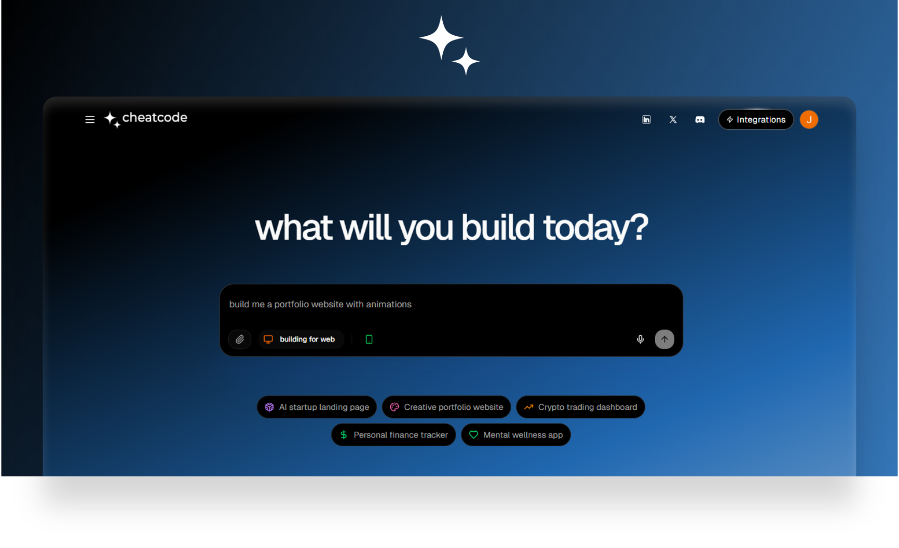
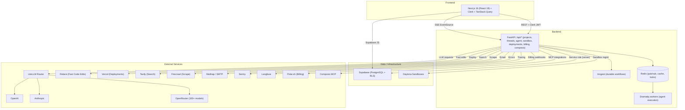

<div align="center">

# Cheatcode - Open Source AI Coding Agent

An open-source, production-ready AI coding agent for apps and websites.

Build, run, and ship full-stack applications with an agent that codes, executes, deploys, and integrates with your stack.

[](./LICENSE-Apache-2.0)
[](#backend-technologies)
[](#frontend-technologies)
[](#infrastructure)
[](#backend-technologies)
[](#frontend-technologies)



</div>

## Table of Contents

- [Overview](#overview)
- [Architecture](#architecture)
- [Agent System](#agent-system)
- [Prerequisites](#prerequisites)
- [Quick Start](#quick-start)
- [Local Development](#local-development)
- [Environment Variables](#environment-variables)
- [Repository Structure](#repository-structure)
- [API Reference](#api-reference)
- [Streaming & Real-Time](#streaming--real-time)
- [Self-Hosting](#self-hosting)
- [CI/CD & Deployment](#cicd--deployment)
- [Technology Stack](#technology-stack)
- [Troubleshooting](#troubleshooting)
- [Contributing](#contributing)
- [License](#license)

## Overview

Cheatcode is a full-stack application that pairs a Next.js dashboard with a FastAPI backend to provide an AI coding agent capable of:

- **Conversational coding** - Create and modify projects through a collaborative chat interface with threaded conversations
- **Sandboxed execution** - Run code inside isolated Daytona sandboxes with live web and mobile (Expo) app previews
- **Multi-model support** - Works with 100+ models via OpenRouter (Google Gemini, Claude, GPT, Grok, Llama, etc.) through LiteLLM
- **Rich tool ecosystem** - File editing, shell execution, grep search, LSP integration, screenshots, vision analysis, and web search
- **Real-time streaming** - SSE-based agent response streaming with batched chunks via Redis pub/sub
- **Authentication & billing** - Clerk authentication with Supabase RLS, token-based billing via Polar.sh, and BYOK (Bring Your Own Key) support

**Optional integrations:**
- Fast code editing with Relace API for rapid inline modifications
- One-click deployments to Vercel for instant production sites
- Third-party app integrations via Composio MCP (GitHub, Slack, Gmail, Notion, etc.)
- LLM observability with Langfuse and error tracking with Sentry

The platform is designed to run locally via Docker Compose or be self-hosted on your own infrastructure.

## Architecture


```mermaid
graph TD
  subgraph Frontend
    FE["Next.js 16 (React 19) + Clerk + TanStack Query"]
  end
  subgraph Backend
    API["FastAPI: /api/* (projects, threads, agent, sandbox, deployments, billing, composio)"]
    Worker["Dramatiq workers (agent execution)"]
    Inngest["Inngest (durable workflows)"]
    Redis[("Redis (pub/sub, cache, locks)")]
  end
  subgraph Data_Infra["Data / Infrastructure"]
    SUP["Supabase (PostgreSQL + RLS)"]
    DAY["Daytona Sandboxes"]
  end
  subgraph External_Services["External Services"]
    LLM["LiteLLM Router"]
    OpenAI["OpenAI"]
    Anthropic["Anthropic"]
    OpenRouter["OpenRouter (100+ models)"]
    Relace["Relace (Fast Code Edits)"]
    Vercel["Vercel (Deployments)"]
    Tav["Tavily (Search)"]
    Fire["Firecrawl (Scrape)"]
    Mail["Mailtrap / SMTP"]
    Sentry["Sentry"]
    Langfuse["Langfuse"]
    Polar["Polar.sh (Billing)"]
    MCP["Composio MCP"]
  end

  FE -->|"REST + Clerk JWT"| API
  FE -->|"SSE EventSource"| API
  FE -->|"Supabase JS"| SUP
  API -->|"Service role (server)"| SUP
  API --> Redis
  Redis --> Worker
  API --> Inngest
  API -->|"Sandbox mgmt"| DAY
  API -->|"MCP integrations"| MCP
  API -->|"Billing webhooks"| Polar
  API -->|"Tracing"| Langfuse
  API -->|"Errors"| Sentry
  API -->|"Search"| Tav
  API -->|"Scrape"| Fire
  API -->|"Email"| Mail
  API -->|"Fast edits"| Relace
  API -->|"Deploy"| Vercel
  API -->|"LLM requests"| LLM
  LLM --> OpenAI
  LLM --> Anthropic
  LLM --> OpenRouter
```

### Core Components

| Component | Technology | Purpose |
|-----------|-----------|---------|
| **Backend API** | FastAPI, Python 3.11 | REST endpoints, thread/project management, LLM orchestration |
| **Worker** | Dramatiq (Redis-backed) | Background agent execution with distributed locks |
| **Durable Workflows** | Inngest | Retryable workflows for deployments, webhooks, scheduled cleanup |
| **Frontend** | Next.js 16, React 19 | Dashboard UI, auth via Clerk, streaming via custom EventSource |
| **Cache/PubSub** | Redis (Upstash in prod) | Response streaming, distributed locks, caching |
| **Database** | Supabase (PostgreSQL) | Persistent storage with Row Level Security |
| **Sandboxes** | Daytona SDK | Isolated code execution environments with live previews |

## Agent System

### How the Agent Works

The agent follows an iterative loop that processes user messages, calls LLM providers, executes tools in sandboxed environments, and streams results back in real-time:

```
1. User sends message → POST /api/thread/{threadId}/agent/start
2. Backend creates agent_run record, queues Dramatiq actor
3. Frontend opens EventSource → GET /api/agent-run/{runId}/stream

4. Agent Loop (up to 100 iterations):
   a) Fetch conversation history from database
   b) Make streaming LLM API call via LiteLLM
   c) Parse response for tool calls (XML or native format)
   d) Execute tools concurrently (max 5 parallel)
   e) Add results to thread, continue if needed
   f) Stream all responses to frontend via Redis pub/sub

5. Completion → agent marks run as finished, cleans up
```

### Available Tools

The agent has access to these tools during execution:

| Tool | File | Capabilities |
|------|------|-------------|
| **Shell** | `sb_shell_tool.py` | Execute commands in sandbox, session management, blocking/non-blocking modes |
| **Files** | `sb_files_tool.py` | Read, write, delete, copy, move files and directories |
| **Grep** | `sb_grep_tool.py` | Full-text search and semantic (embedding-based) search across files |
| **Screenshot** | `sb_screenshot_tool.py` | Capture browser screenshots for visual verification |
| **Vision** | `sb_vision_tool.py` | AI-powered screenshot analysis, design system analysis |
| **LSP** | `sb_lsp_tool.py` | Find definitions, references, and hover info via Language Server Protocol |
| **Web Search** | `web_search_tool.py` | Search the web via Tavily API for docs, libraries, best practices |
| **Components** | `component_search_tool.py` | Embedding-based component discovery for code reuse |
| **Completion** | `completion_tool.py` | Mark task as complete, gracefully stop agent |
| **MCP Wrapper** | `mcp_tool_wrapper.py` | Dynamic integration of Composio MCP tools (GitHub, Slack, etc.) |

### Supported Models

The default model is `openrouter/google/gemini-2.5-pro`. Through OpenRouter + LiteLLM, the agent supports 100+ models including:

- Google Gemini 2.5 Pro / Flash
- Anthropic Claude Sonnet 4 / Opus
- OpenAI GPT-4o / GPT-4.1
- xAI Grok-2
- Meta Llama 3.3 70B
- And many more via OpenRouter

Extended thinking is supported for Claude models via `enable_thinking` and `reasoning_effort` parameters.

## Prerequisites

### System Requirements

- **Memory**: 4GB RAM minimum, 8GB recommended
- **Storage**: 2GB free space for Docker images
- **OS**: Linux, macOS, or Windows with WSL2

### Required Software

- **Docker 24.0+** and **Docker Compose 2.0+**
- **Node.js 20+** (for local development without Docker)
- **Python 3.11+** (for local development without Docker)
- **[uv](https://github.com/astral-sh/uv)** (Python package manager)
- **Git 2.30+**

### Required Accounts

- **Supabase project** with URL, anon key, and service role key
- **Clerk application** with publishable key and secret key
- **At least one LLM provider**: OpenAI, Anthropic, or OpenRouter API key
- **Daytona account** for sandbox code execution and app previews
- **Tavily API key** for web search capabilities

### Optional Integrations

- **Firecrawl API key** for web scraping capabilities
- **Vercel account** for one-click deployments
- **Relace API key** for fast inline code edits
- **Composio account** for third-party app integrations (GitHub, Slack, etc.)
- **Polar.sh account** for billing/subscription management
- **Sentry** for error monitoring
- **Langfuse** for LLM observability and tracing

## Quick Start

### 1. Clone the Repository

```bash
git clone https://github.com/cheatcode-ai/cheatcode.git
cd cheatcode
```

### 2. Backend Configuration

Create `backend/.env.local` (for Docker) or `backend/.env` (for local dev):

```env
# Core Configuration
ENV_MODE=local
SUPABASE_URL=YOUR_SUPABASE_URL
SUPABASE_ANON_KEY=YOUR_SUPABASE_ANON_KEY
SUPABASE_SERVICE_ROLE_KEY=YOUR_SUPABASE_SERVICE_ROLE_KEY

# Authentication
CLERK_SECRET_KEY=YOUR_CLERK_SECRET_KEY

# Redis (Docker Compose uses service name 'redis')
REDIS_URL=redis://redis:6379

# Sandbox Integration (required for code execution)
DAYTONA_API_KEY=YOUR_DAYTONA_API_KEY
DAYTONA_SERVER_URL=YOUR_DAYTONA_SERVER_URL
DAYTONA_TARGET=YOUR_DAYTONA_TARGET

# Web Search (required)
TAVILY_API_KEY=YOUR_TAVILY_API_KEY

# LLM Providers (at least one required)
OPENAI_API_KEY=YOUR_OPENAI_API_KEY
ANTHROPIC_API_KEY=YOUR_ANTHROPIC_API_KEY
OPENROUTER_API_KEY=YOUR_OPENROUTER_API_KEY

# Optional: Web Scraping
FIRECRAWL_API_KEY=YOUR_FIRECRAWL_API_KEY

# Optional: Deployment (Vercel)
VERCEL_BEARER_TOKEN=YOUR_VERCEL_BEARER_TOKEN
VERCEL_TEAM_ID=YOUR_VERCEL_TEAM_ID

# Optional: Fast Code Edits (Relace)
RELACE_API_KEY=YOUR_RELACE_API_KEY

# Optional: Third-Party Integrations (Composio)
COMPOSIO_API_KEY=YOUR_COMPOSIO_API_KEY

# Optional: Observability
LANGFUSE_PUBLIC_KEY=YOUR_LANGFUSE_PUBLIC_KEY
LANGFUSE_SECRET_KEY=YOUR_LANGFUSE_SECRET_KEY
LANGFUSE_HOST=https://us.cloud.langfuse.com

# Optional: Error Tracking
SENTRY_DSN=YOUR_SENTRY_DSN

# Optional: Billing (Polar.sh)
POLAR_ACCESS_TOKEN=YOUR_POLAR_ACCESS_TOKEN
POLAR_WEBHOOK_SECRET=YOUR_POLAR_WEBHOOK_SECRET
```

### 3. Frontend Configuration

Create `frontend/.env.local`:

```env
# Backend URL
NEXT_PUBLIC_BACKEND_URL=http://localhost:8000

# Supabase Configuration
NEXT_PUBLIC_SUPABASE_URL=YOUR_SUPABASE_URL
NEXT_PUBLIC_SUPABASE_ANON_KEY=YOUR_SUPABASE_ANON_KEY

# Application URLs
NEXT_PUBLIC_APP_URL=http://localhost:3000
NEXT_PUBLIC_URL=http://localhost:3000

# Authentication
NEXT_PUBLIC_CLERK_PUBLISHABLE_KEY=YOUR_CLERK_PUBLISHABLE_KEY

# Optional: Feature Flags
NEXT_PUBLIC_FEATURE_FLAGS_ENABLED=false
```

### 4. Start the Application

```bash
docker compose up --build
```

### 5. Access the Application

| Service | Docker URL | Local Dev URL |
|---------|-----------|---------------|
| **Frontend** | http://localhost:3003 | http://localhost:3000 |
| **Backend API** | http://localhost:8000 | http://localhost:8000 |
| **API Health** | http://localhost:8000/api/health | http://localhost:8000/api/health |
| **Redis** | localhost:6380 | localhost:6379 |

### 6. First-Run Verification

1. **API Health**: Visit http://localhost:8000/api/health (expect `{ "status": "ok" }`)
2. **Frontend Access**: Visit http://localhost:3003 (Docker) and sign in with Clerk
3. **Create Project**: Create a new project and thread
4. **Test Agent**: Send a message and start the agent

## Local Development

For development without Docker:

### Backend

```bash
cd backend

# Install dependencies (requires uv: https://github.com/astral-sh/uv)
uv sync

# Start the API server
uv run uvicorn main:app --reload --host 0.0.0.0 --port 8000

# In a separate terminal, start the Dramatiq worker
uv run dramatiq --skip-logging --processes 1 --threads 2 run_agent_background
```

### Frontend

```bash
cd frontend

# Install dependencies
npm install

# Start development server
npm run dev
```

### Docker Compose (Development)

The `docker-compose.dev.yml` provides hot-reload for both backend and frontend:

```bash
docker compose -f docker-compose.dev.yml up
```

This starts:
- **Backend** (port 8000) - uvicorn with `--reload`
- **Worker** - Dramatiq with 1 process, 2 threads
- **Frontend** (port 3000) - Next.js dev server with Turbopack
- **Redis** (port 6380 → 6379) - Redis 8 Alpine with append-only persistence

### Code Quality

```bash
# Backend linting & formatting
cd backend
uv run ruff check .                    # Lint
uv run ruff format .                   # Format

# Frontend linting & formatting
cd frontend
npx eslint src/ --max-warnings=0       # Lint (strict)
npx prettier --check "src/**/*.{ts,tsx,css,json}"  # Format check
npx knip                               # Detect unused code/deps
```

### Running Tests

```bash
cd backend
uv run pytest                          # Run all tests
uv run pytest --asyncio-mode=auto      # Run async tests
```

## Environment Variables

### Backend Variables (`backend/.env`)

| Variable | Required | Description |
|----------|----------|-------------|
| `ENV_MODE` | Yes | `local` for development, `production` for production |
| `SUPABASE_URL` | Yes | Supabase project URL |
| `SUPABASE_ANON_KEY` | Yes | Supabase anonymous/public key |
| `SUPABASE_SERVICE_ROLE_KEY` | Yes | Supabase service role key (server-side) |
| `CLERK_SECRET_KEY` | Yes | Clerk backend secret key |
| `REDIS_URL` | Yes | Redis connection URL (`redis://redis:6379` for Docker) |
| `DAYTONA_API_KEY` | Yes | Daytona API key for sandboxes |
| `DAYTONA_SERVER_URL` | Yes | Daytona server URL |
| `DAYTONA_TARGET` | Yes | Daytona target region (e.g., `us`) |
| `TAVILY_API_KEY` | Yes | Tavily API key for web search |
| `OPENAI_API_KEY` | * | OpenAI API key |
| `ANTHROPIC_API_KEY` | * | Anthropic API key |
| `OPENROUTER_API_KEY` | * | OpenRouter API key |
| `FIRECRAWL_API_KEY` | No | Firecrawl API key for web scraping |
| `FIRECRAWL_URL` | No | Firecrawl endpoint URL |
| `VERCEL_BEARER_TOKEN` | No | Vercel API token for deployments |
| `VERCEL_TEAM_ID` | No | Vercel team ID |
| `RELACE_API_KEY` | No | Relace API key for fast code edits |
| `COMPOSIO_API_KEY` | No | Composio API key for third-party integrations |
| `LANGFUSE_PUBLIC_KEY` | No | Langfuse public key for LLM observability |
| `LANGFUSE_SECRET_KEY` | No | Langfuse secret key |
| `LANGFUSE_HOST` | No | Langfuse endpoint URL |
| `SENTRY_DSN` | No | Sentry DSN for error monitoring |
| `POLAR_ACCESS_TOKEN` | No | Polar.sh access token for billing |
| `POLAR_WEBHOOK_SECRET` | No | Polar webhook verification secret |
| `MODEL_TO_USE` | No | Default LLM model name |
| `MCP_CREDENTIAL_ENCRYPTION_KEY` | No | Encryption key for MCP credentials |
| `INNGEST_EVENT_KEY` | No | Inngest event key |
| `INNGEST_SIGNING_KEY` | No | Inngest signing key |
| `FEATURE_FLAGS_ENABLED` | No | Enable feature flag system |

\* At least one LLM provider key is required.

### Frontend Variables (`frontend/.env.local`)

| Variable | Required | Description |
|----------|----------|-------------|
| `NEXT_PUBLIC_BACKEND_URL` | Yes | Backend API URL |
| `NEXT_PUBLIC_SUPABASE_URL` | Yes | Supabase project URL |
| `NEXT_PUBLIC_SUPABASE_ANON_KEY` | Yes | Supabase anonymous key |
| `NEXT_PUBLIC_APP_URL` | Yes | Frontend application URL |
| `NEXT_PUBLIC_URL` | Yes | Frontend URL (for redirects) |
| `NEXT_PUBLIC_CLERK_PUBLISHABLE_KEY` | Yes | Clerk publishable key |
| `NEXT_PUBLIC_ENV_MODE` | No | `local` or `production` |
| `NEXT_PUBLIC_FEATURE_FLAGS_ENABLED` | No | Enable feature flags (default: `false`) |
| `EDGE_CONFIG` | No | Vercel Edge Config (if using Vercel) |

## Repository Structure

```
cheatcode/
├── backend/                          # FastAPI backend service
│   ├── agent/                        # Agent runtime & orchestration
│   │   ├── api.py                    # Agent REST endpoints
│   │   ├── run.py                    # Agent execution loop (LLM + tools)
│   │   ├── schemas.py                # Pydantic models for agent I/O
│   │   └── tools/                    # Agent tool implementations
│   │       ├── sb_shell_tool.py      #   Shell command execution
│   │       ├── sb_files_tool.py      #   File read/write/delete
│   │       ├── sb_grep_tool.py       #   Text & semantic search
│   │       ├── sb_screenshot_tool.py #   Browser screenshots
│   │       ├── sb_vision_tool.py     #   Vision model analysis
│   │       ├── sb_lsp_tool.py        #   Language Server Protocol
│   │       ├── web_search_tool.py    #   Tavily web search
│   │       ├── component_search_tool.py # Component discovery
│   │       ├── completion_tool.py    #   Task completion signal
│   │       └── mcp_tool_wrapper.py   #   Dynamic MCP tool integration
│   ├── agentpress/                   # Agent framework (threads, tools, context)
│   │   ├── thread_manager.py         # Conversation thread management
│   │   ├── response_processor.py     # LLM response parsing & tool execution
│   │   ├── tool_registry.py          # Tool registration & discovery
│   │   ├── tool.py                   # Base Tool class & schemas
│   │   └── context_manager.py        # Token limit & context management
│   ├── services/                     # Core service integrations
│   │   ├── llm.py                    # LiteLLM wrapper with circuit breaker
│   │   ├── structured_llm.py         # Instructor-based structured outputs
│   │   ├── redis.py                  # Redis client, pub/sub, helpers
│   │   ├── supabase.py               # Supabase DB client (singleton)
│   │   ├── billing.py                # Billing endpoints & plan management
│   │   ├── token_billing.py          # Token usage tracking & deduction
│   │   ├── openrouter_pricing.py     # Model cost calculation
│   │   ├── polar_service.py          # Polar.sh checkout & webhooks
│   │   ├── vercel_deploy.py          # Vercel deployment service
│   │   ├── langfuse.py               # LangFuse observability
│   │   ├── email.py                  # Mailtrap email service
│   │   ├── inngest_client.py         # Inngest client setup
│   │   └── user_openrouter_keys.py   # BYOK key management
│   ├── composio_integration/         # Composio MCP integrations & OAuth
│   │   ├── api.py                    # Composio REST endpoints
│   │   └── secure_mcp_api.py         # Secure MCP server management
│   ├── inngest_functions/            # Durable workflow functions
│   ├── sandbox/                      # Daytona sandbox management
│   │   └── api.py                    # Sandbox REST endpoints
│   ├── deployments/                  # Vercel deployment API
│   │   └── api.py                    # Deployment endpoints
│   ├── api/webhooks/                 # Webhook handlers
│   │   └── polar.py                  # Polar billing webhooks
│   ├── flags/                        # Feature flag system
│   ├── utils/                        # Utilities
│   │   ├── config.py                 # Environment & config singleton
│   │   ├── auth_utils.py             # Clerk JWT verification
│   │   ├── models.py                 # Model configs & token limits
│   │   └── logger.py                 # Structured logging setup
│   ├── supabase/                     # Database migrations & config
│   │   └── migrations/               # SQL migration files
│   ├── tests/                        # Test suite (pytest)
│   ├── main.py                       # FastAPI app entry point
│   ├── run_agent_background.py       # Dramatiq actor for background execution
│   ├── projects_threads_api.py       # Projects & threads endpoints
│   ├── pyproject.toml                # Python dependencies (uv)
│   ├── Dockerfile                    # Production API image
│   ├── Dockerfile.dev                # Development API image
│   └── Dockerfile.worker             # Production worker image
│
├── frontend/                         # Next.js 16 application
│   ├── src/
│   │   ├── app/                      # App Router pages & layouts
│   │   │   ├── (home)/               # Main app group route
│   │   │   │   ├── projects/[projectId]/thread/  # Thread UI
│   │   │   │   │   ├── _contexts/    # ThreadState, Actions, Billing, Layout
│   │   │   │   │   ├── _components/  # Thread page components
│   │   │   │   │   └── [threadId]/page.tsx  # Main chat page
│   │   │   │   └── (personalAccount)/settings/  # Settings pages
│   │   │   ├── sign-in/              # Clerk sign-in
│   │   │   ├── sign-up/              # Clerk sign-up
│   │   │   ├── providers.tsx         # Provider composition (Clerk, Query, Auth)
│   │   │   └── layout.tsx            # Root layout (dark theme, fonts, analytics)
│   │   ├── components/               # React components
│   │   │   ├── thread/               # Chat interface
│   │   │   │   ├── content/          # Message rendering (ThreadContent, StreamingContent)
│   │   │   │   ├── chat-input/       # Message input with file upload
│   │   │   │   ├── preview-renderers/ # CodeEditor, FileTree, PreviewTab, MobilePreview
│   │   │   │   └── thread-site-header.tsx  # Header with model selector
│   │   │   ├── ui/                   # shadcn/ui + custom components
│   │   │   ├── billing/              # Billing UI
│   │   │   ├── integrations/         # Composio integration UI
│   │   │   └── sidebar/              # Navigation sidebar
│   │   ├── hooks/                    # Custom React hooks
│   │   │   ├── useAgentStream.ts     # SSE streaming with reconnection
│   │   │   ├── useAgentStateMachine.ts # Agent state machine
│   │   │   └── react-query/          # React Query hooks
│   │   ├── lib/                      # Utilities & API clients
│   │   │   ├── api/                  # API client functions
│   │   │   │   ├── agents.ts         # Agent start/stop/stream
│   │   │   │   ├── projects.ts       # CRUD projects
│   │   │   │   ├── threads.ts        # CRUD threads & messages
│   │   │   │   ├── billing.ts        # Billing status & checkout
│   │   │   │   └── sandbox.ts        # Sandbox file management
│   │   │   ├── api-client.ts         # Generic HTTP client
│   │   │   └── error-handler.ts      # Error handling utilities
│   │   ├── contexts/                 # React Context providers
│   │   │   ├── AuthTokenContext.tsx   # Clerk token caching (5 min)
│   │   │   └── BillingContext.tsx     # Global billing state
│   │   └── providers/                # Provider wrappers
│   ├── public/                       # Static assets
│   ├── package.json                  # npm dependencies
│   ├── next.config.ts                # Next.js config (Turbopack)
│   ├── tailwind.config.ts            # Tailwind CSS 4 config
│   ├── vercel.json                   # Vercel deployment config
│   └── Dockerfile                    # Multi-stage (dev/production)
│
├── api-worker/                       # Cloudflare Worker - API proxy
│   ├── src/index.ts                  # Proxies api.trycheatcode.com → Cloud Run
│   └── wrangler.toml                 # Cloudflare config
│
├── preview-worker/                   # Cloudflare Worker - Preview proxy
│   ├── src/index.ts                  # Proxies preview.trycheatcode.com → Daytona
│   └── wrangler.toml                 # Cloudflare config (HTTP + WebSocket)
│
├── docker-compose.yaml               # Production Docker orchestration
├── docker-compose.dev.yml            # Development Docker orchestration
├── .github/workflows/                # CI/CD pipelines
│   ├── docker-build.yml              # Build & deploy to Google Cloud Run
│   ├── cloudflare-workers.yml        # Deploy Cloudflare Workers
│   └── lint.yml                      # Ruff (backend) + ESLint/Prettier/Knip (frontend)
├── LICENSE-Apache-2.0                # Apache 2.0 license
├── NOTICE                            # Third-party attribution
└── README.md                         # This file
```

## API Reference

All backend endpoints are prefixed with `/api`.

### Health & Status

| Method | Endpoint | Description |
|--------|----------|-------------|
| GET | `/api/health` | Health check - returns `{ status, timestamp, instance_id }` |

### Projects & Threads

| Method | Endpoint | Description |
|--------|----------|-------------|
| GET | `/api/projects` | List all projects for authenticated user |
| POST | `/api/projects` | Create a new project |
| GET | `/api/projects/{project_id}` | Get project details |
| GET | `/api/threads` | List threads (optionally filtered by project) |
| POST | `/api/threads` | Create a new thread in a project |

### Agent Management

| Method | Endpoint | Description |
|--------|----------|-------------|
| GET | `/api/models/available` | List available LLM models |
| POST | `/api/thread/{thread_id}/agent/start` | Start an agent run (accepts `model_name`, `enable_thinking`, `reasoning_effort`, `app_type`) |
| GET | `/api/agent-run/{agent_run_id}/stream` | Stream agent responses via SSE (supports `?token=` query param) |
| POST | `/api/agent-run/{agent_run_id}/stop` | Stop an active agent run |
| GET | `/api/agent-run/{agent_run_id}/status` | Get agent run status |
| GET | `/api/agent-run/{agent_run_id}` | Get agent run details |
| GET | `/api/thread/{thread_id}/agent-runs` | List all agent runs for a thread |
| POST | `/api/agent/initiate` | Create project + thread and initiate agent with files |

### Sandbox Operations

| Method | Endpoint | Description |
|--------|----------|-------------|
| POST | `/api/project/{project_id}/sandbox/ensure-active` | Ensure sandbox is running |
| POST | `/api/sandboxes/{sandbox_id}/files` | Upload files to sandbox |
| GET | `/api/sandboxes/{sandbox_id}/files` | List files in directory |
| GET | `/api/sandboxes/{sandbox_id}/files/tree` | Get hierarchical file tree |
| GET | `/api/sandboxes/{sandbox_id}/files/content` | Get file content |
| GET | `/api/sandboxes/{sandbox_id}/download-archive` | Download files as archive |
| DELETE | `/api/sandboxes/{sandbox_id}/files` | Delete files |
| DELETE | `/api/sandboxes/{sandbox_id}` | Delete entire sandbox |
| POST | `/api/sandboxes/{sandbox_id}/execute` | Execute shell command |
| GET | `/api/sandboxes/{sandbox_id}/sessions/{session_name}/status` | Check command status |
| GET | `/api/sandboxes/{sandbox_id}/preview-url` | Get web preview URL |
| GET | `/api/sandboxes/{sandbox_id}/expo-url` | Get Expo preview URL (mobile) |
| GET | `/api/sandboxes/{sandbox_id}/dev-server/stream` | Stream dev server output |

### Deployments

| Method | Endpoint | Description |
|--------|----------|-------------|
| POST | `/api/project/{project_id}/deploy/git` | Deploy project to Vercel |
| POST | `/api/project/{project_id}/deploy/git/update` | Update existing deployment |
| GET | `/api/project/{project_id}/deployment/status` | Get deployment status |
| GET | `/api/project/{project_id}/deployment/live-status` | Get live deployment status |

### Billing & Usage

| Method | Endpoint | Description |
|--------|----------|-------------|
| GET | `/api/billing/status` | Get billing/subscription status |
| GET | `/api/billing/subscription` | Get subscription details |
| GET | `/api/billing/usage-history` | Get token usage history |
| GET | `/api/billing/plans` | List available plans |
| POST | `/api/billing/create-checkout-session` | Create Polar checkout session |
| POST | `/api/billing/upgrade-plan` | Upgrade subscription plan |
| POST | `/api/billing/openrouter-key` | Store custom OpenRouter API key (BYOK) |
| GET | `/api/billing/openrouter-key/status` | Check BYOK key status |
| DELETE | `/api/billing/openrouter-key` | Remove custom key |
| POST | `/api/billing/openrouter-key/test` | Test OpenRouter key validity |

### Composio Integrations

| Method | Endpoint | Description |
|--------|----------|-------------|
| GET | `/api/composio/health` | Composio health check |
| GET | `/api/composio/categories` | List tool categories |
| GET | `/api/composio/toolkits` | List available toolkits |
| GET/POST/PUT/DELETE | `/api/composio/profiles/*` | Manage OAuth profiles |
| GET | `/api/composio/connections` | List connections |
| POST | `/api/composio/discover-tools/{profile_id}` | Discover profile tools |

### Webhooks

| Method | Endpoint | Description |
|--------|----------|-------------|
| POST | `/api/webhooks/polar` | Polar billing webhook (subscription events) |
| POST | `/api/inngest` | Inngest event webhook (internal) |

## Streaming & Real-Time

### SSE Architecture

The agent streams responses to the frontend using Server-Sent Events (SSE) through Redis pub/sub:

```
Frontend                          Backend                         Redis
═══════════════════════════════════════════════════════════════════════
EventSource(/stream/{runId})  →   SSE endpoint subscribes    →   Subscribe to
                                  to Redis channel                agent_run:{id}:new_response

                              ←   Batched JSON responses     ←   Agent pushes to
                                  (25 chunks or 75ms)             agent_run:{id}:responses

                              ←   Control signals            ←   agent_run:{id}:control
                                  (END_STREAM, STOP, ERROR)       (STOP, END_STREAM, ERROR)
```

### Redis Key Patterns

```
agent_run:{id}:responses      # FIFO list of JSON response objects (24h TTL)
agent_run:{id}:new_response   # Pub/sub channel for new response notifications
agent_run:{id}:control        # Pub/sub channel for control signals
agent_run_lock:{id}           # Distributed lock for idempotent execution
```

### Frontend Streaming Hook

The `useAgentStream` hook manages the EventSource connection with:
- Exponential backoff reconnection (1s → 30s max, 5 retries)
- Jitter to prevent thundering herd
- 45-second heartbeat timeout (backend pings every 15s)
- Ordered chunk aggregation by sequence number
- Message deduplication by `message_id`
- Automatic status transitions via `useAgentStateMachine`

### Agent State Machine

States: `idle` → `connecting` → `running` → `completed` | `stopped` | `failed` | `error`

## Self-Hosting

### Option 1: Docker Compose (Recommended for Self-Hosting)

1. **Provision Infrastructure**
   - Deploy on any Docker-compatible host (VPS, cloud instance, etc.)
   - Ensure adequate resources (4GB+ RAM recommended)

2. **Configuration**
   - Set `ENV_MODE=production` in `backend/.env.local`
   - Configure proper domain names and TLS certificates
   - Update CORS settings in `backend/main.py` to include your domain

3. **DNS & TLS**
   - Point your domain to your server
   - Configure reverse proxy (Nginx, Traefik, or Caddy) for HTTPS
   - Expose ports 80/443 instead of 3000/8000

4. **Start Services**
   ```bash
   docker compose up -d --build
   ```

### Option 2: Cloud Deployment

**Frontend → Vercel**
- Connect your GitHub repo to Vercel
- Auto-deploys on push to main branch
- Configure environment variables in Vercel dashboard

**Backend → Google Cloud Run**
- Use the included GitHub Actions workflow (`.github/workflows/docker-build.yml`)
- Automatically builds and deploys API + Worker on push to main
- Configure secrets in GitHub repository settings

**Workers → Cloudflare**
- Deploy `api-worker/` and `preview-worker/` to Cloudflare Workers
- API Worker proxies requests to Cloud Run backend
- Preview Worker proxies sandbox previews from Daytona with WebSocket support

### Docker Compose Services

**Production** (`docker-compose.yaml`):

| Service | Image | Port | Description |
|---------|-------|------|-------------|
| `api` | `backend/Dockerfile` | 8000 | FastAPI with Gunicorn + Uvicorn workers |
| `worker` | `backend/Dockerfile` | - | Dramatiq (2 processes, 4 threads) |
| `frontend` | `frontend/Dockerfile` | 3003→3000 | Next.js production build |
| `redis` | `redis:8-alpine` | 6380→6379 | Redis with append-only, 8GB max memory |

**Development** (`docker-compose.dev.yml`):

| Service | Image | Port | Description |
|---------|-------|------|-------------|
| `backend` | `backend/Dockerfile.dev` | 8000 | uvicorn with hot reload |
| `worker` | `backend/Dockerfile.dev` | - | Dramatiq (1 process, 2 threads) |
| `frontend` | `frontend/Dockerfile` (dev target) | 3000 | Next.js dev server with Turbopack |
| `redis` | `redis:8-alpine` | 6380→6379 | Redis with append-only |

## CI/CD & Deployment

### GitHub Actions Workflows

| Workflow | Trigger | Purpose |
|----------|---------|---------|
| `docker-build.yml` | Push to `main` (backend changes) | Build Docker images, deploy API + Worker to Google Cloud Run |
| `cloudflare-workers.yml` | Push to `main` (worker changes) | Deploy API Worker and Preview Worker to Cloudflare |
| `lint.yml` | PRs to `main` + pushes | Ruff (backend), ESLint + Prettier + Knip (frontend) |

### Required GitHub Secrets

- `GCP_SA_KEY` - Google Cloud service account JSON key
- `CLOUDFLARE_API_TOKEN` - Cloudflare API token

### Production Infrastructure

- **Backend**: Google Cloud Run (asia-south1), 2 CPU / 4GB RAM, 0-10 instances
- **Worker**: Google Cloud Run, 2 CPU / 4GB RAM, 1-3 instances (always-on)
- **Frontend**: Vercel (auto-deploy from main)
- **API Proxy**: Cloudflare Worker at `api.trycheatcode.com`
- **Preview Proxy**: Cloudflare Worker at `preview.trycheatcode.com`
- **Database**: Supabase (managed PostgreSQL)
- **Cache**: Upstash Redis

## Technology Stack

### Frontend Technologies

| Category | Technology | Version |
|----------|-----------|---------|
| Framework | Next.js (App Router + Turbopack) | 16.0.7 |
| UI Library | React | 19.2.1 |
| Language | TypeScript | 5.9.3 |
| Styling | Tailwind CSS | 4.1.17 |
| UI Components | Radix UI + shadcn/ui | Various |
| State (server) | TanStack React Query | 5.90.12 |
| State (client) | Zustand | 5.0.9 |
| Auth | Clerk | 6.35.6 |
| Code Editor | CodeMirror | 6.38.8 |
| Markdown | react-markdown + remark-gfm | 10.1.0 |
| Animations | Motion (Framer Motion) | 12.23.25 |
| Icons | Lucide React | 0.555.0 |
| Toasts | Sonner | 2.0.3 |
| Analytics | Vercel Analytics + Speed Insights | - |
| Package Manager | npm | - |

### Backend Technologies

| Category | Technology | Version |
|----------|-----------|---------|
| Framework | FastAPI | 0.123.7 |
| Server | uvicorn (dev) / Gunicorn (prod) | 0.38.0 / 23+ |
| Language | Python | 3.11+ |
| LLM Router | LiteLLM | 1.80.7 |
| Structured LLM | Instructor | 1.7.0 |
| Task Queue | Dramatiq (Redis-backed) | 2.0.0 |
| Durable Workflows | Inngest | 0.5.15 |
| Database | Supabase (PostgreSQL) | 2.25.0+ |
| Cache/PubSub | Redis | 7.1.0+ |
| Auth | Clerk (clerk-backend-api) | 4.1.2 |
| Sandboxing | Daytona SDK | 0.121.0+ |
| Integrations | Composio + MCP | 0.9.4 / 1.23.1 |
| Billing | Polar SDK | 0.28.0+ |
| Observability | Langfuse | 3.10.5 |
| Error Tracking | Sentry | 2.47.0 |
| Logging | structlog | 25.5.0 |
| Web Search | Tavily | 0.7.13 |
| Email | Mailtrap | 2.3.0 |
| HTTP Client | httpx | 0.28.1+ |
| Retry Logic | tenacity | 8.2.0+ |
| Package Manager | uv | - |
| Linting | Ruff | 0.11.12 |

### Infrastructure

| Category | Technology | Purpose |
|----------|-----------|---------|
| Containerization | Docker + Docker Compose | Local dev & production orchestration |
| Backend Hosting | Google Cloud Run | Auto-scaling container deployment |
| Frontend Hosting | Vercel | Edge deployment with auto-deploy |
| API Proxy | Cloudflare Workers | Request proxying with CORS |
| Preview Proxy | Cloudflare Workers | Sandbox preview with WebSocket support |
| Database | Supabase (PostgreSQL) | Persistent storage with RLS |
| Cache | Redis / Upstash | Streaming, locks, caching |
| CI/CD | GitHub Actions | Automated builds, deploys, linting |
| Tool Manager | mise | Python 3.11.10 + Node 20 + uv 0.6.5 |

## Troubleshooting

### Common Issues

#### Permission Denied Errors with Docker

```bash
# Fix file permissions
sudo chown -R $USER:$USER .

# Add user to docker group (requires logout/login)
sudo usermod -aG docker $USER
```

#### Backend Not Starting

1. **Check Environment Variables**
   ```bash
   # Verify .env file exists and contains required variables
   cat backend/.env
   ```

2. **Test Supabase Connection**
   ```bash
   curl "YOUR_SUPABASE_URL/rest/v1/" -H "apikey: YOUR_SUPABASE_ANON_KEY"
   ```

3. **Check Redis Connectivity**
   ```bash
   docker compose logs redis
   docker exec -it $(docker compose ps -q redis) redis-cli ping
   ```

4. **Verify LLM Provider Keys**
   ```bash
   curl -H "Authorization: Bearer YOUR_OPENAI_KEY" https://api.openai.com/v1/models
   ```

#### Frontend 401 Errors

1. **Verify Clerk Configuration**
   - Check `NEXT_PUBLIC_CLERK_PUBLISHABLE_KEY` in `frontend/.env.local`
   - Ensure `CLERK_SECRET_KEY` is set in `backend/.env`
   - Verify Clerk domain settings match your application URL

2. **Check CORS Settings**
   - Ensure your frontend URL is in `allowed_origins` in `backend/main.py`
   - For custom domains, add them to the CORS configuration

#### Agent Not Responding

1. **Check Worker Status**
   ```bash
   docker compose logs worker
   ```

2. **LLM Provider Issues**
   - Verify API keys are correct and active
   - Check rate limits and usage quotas
   - Review backend logs for LLM errors

3. **Sandbox Issues**
   - Ensure Daytona credentials are configured
   - Check Daytona service status

#### Database Issues

1. **Missing Tables** - Ensure all Supabase migrations have been applied
2. **RLS Errors** - Verify service role key has proper permissions
3. **Check logs**: `docker compose logs api`

### Getting Help

```bash
# View all service logs
docker compose logs

# View specific service logs
docker compose logs api
docker compose logs worker
docker compose logs frontend
docker compose logs redis

# Restart services
docker compose restart

# Rebuild containers
docker compose up --build

# Full reset
docker compose down && docker compose up --build
```

## Contributing

We welcome contributions from the community!

### How to Contribute

1. **Fork** the repository
2. **Clone** your fork: `git clone https://github.com/YOUR_USERNAME/cheatcode.git`
3. **Set up** the development environment (see [Local Development](#local-development))
4. **Create** a feature branch: `git checkout -b feature/your-feature-name`
5. **Make** your changes with clear, descriptive commits
6. **Test** locally and ensure linting passes
7. **Push** to your branch: `git push origin feature/your-feature-name`
8. **Open** a Pull Request with a clear title and description

### Development Guidelines

- **Code Style**: Ruff (backend) and ESLint + Prettier (frontend) enforce style automatically
- **Testing**: Add tests for new features (`pytest` for backend)
- **Documentation**: Update relevant docs for any changes
- **Commits**: Use clear, descriptive commit messages
- **PRs**: Keep PRs focused and reasonably sized

### Areas for Contribution

- Bug fixes and issue resolution
- New agent tools and capabilities
- Additional LLM provider support
- Documentation improvements
- Test coverage
- Performance optimization
- New third-party integrations

### Security

If you discover a security vulnerability, please report it responsibly by emailing founders@trycheatcode.com instead of creating a public issue.

## License

Copyright 2025 Cheatcode AI

Portions of this software are derived from [Suna by Kortix AI](https://github.com/kortix-ai/suna),
which is licensed under the Apache License 2.0. See `NOTICE` file for details.

Licensed under the Apache License, Version 2.0 (the "License"); you may not use this file except in compliance with the License. You may obtain a copy of the License at:

http://www.apache.org/licenses/LICENSE-2.0

Unless required by applicable law or agreed to in writing, software distributed under the License is distributed on an "AS IS" BASIS, WITHOUT WARRANTIES OR CONDITIONS OF ANY KIND, either express or implied. See the License for the specific language governing permissions and limitations under the License.

---

Built by [Jigyansu Rout](https://jigyansurout.com/)
