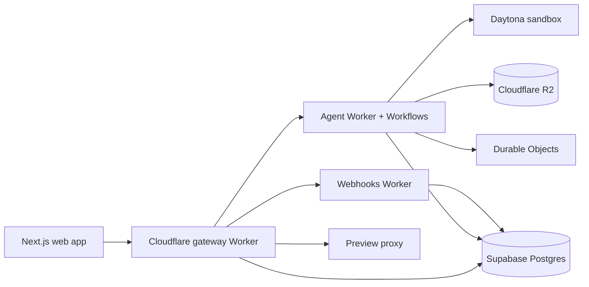

# Cheatcode

[](https://github.com/cheatcode-ai/cheatcode/actions/workflows/static-checks.yml) [](package.json) [](package.json) [](tsconfig.base.json) [](LICENSE)

Cheatcode is a source-available generalist AI agent platform. Give it an
outcome—not a sequence of tool calls—and it can build applications, create
documents and media, research the live web, and operate browser workflows in an
isolated workspace.

The project is built for people who want an inspectable, self-hostable agent
stack without surrendering provider choice. Users bring their own model keys;
the platform keeps long-running work, browser execution, files, generated
outputs, and tenant data behind explicit boundaries.

[Try Cheatcode](https://trycheatcode.com) · [Quickstart](#quickstart) · [Architecture](#architecture) · [Contributing](CONTRIBUTING.md) · [Security](SECURITY.md)

## What it does

| Surface | Outcome |
|---|---|
| Web and mobile apps | Builds, runs, inspects, and iterates on applications inside isolated project workspaces. |
| Research | Searches the live web, synthesizes cited findings, and produces reusable reports. |
| Documents and data | Creates documents, slides, spreadsheets, PDFs, and other downloadable outputs. |
| Media | Generates and works with images, audio, and video through configured providers. |
| Browser workflows | Navigates and operates websites in a project-scoped browser runtime. |
| Connected apps | Uses explicitly connected services through bounded, user-authorized actions. |

## Architecture


```mermaid
flowchart LR
  Browser[Next.js web app] --> Gateway[Cloudflare gateway Worker]
  Gateway --> Agent[Agent Worker + Workflows]
  Gateway --> Webhooks[Webhooks Worker]
  Gateway --> Preview[Preview proxy]
  Agent --> Sandbox[Daytona sandbox]
  Gateway --> DB[(Supabase Postgres)]
  Agent --> DB
  Webhooks --> DB
  Agent --> R2[(Cloudflare R2)]
  Agent --> DO[Durable Objects]
```

- Next.js 16 and React 19 provide the product UI.
- Cloudflare Workers, Workflows, and Durable Objects own admission, execution,
  webhooks, and streaming.
- Daytona supplies one isolated workspace and browser runtime per project.
- Supabase Postgres stores metadata and durable workflow state through three
  least-privilege roles. Generated files live in R2, not Postgres.
- Clerk provides authentication; Polar and Composio support billing and
  connected-app access.

Package and application READMEs document the detailed ownership boundaries.

## Quickstart

You need:

- Node `24.18.0` and pnpm `11.15.0` (the exact versions in `package.json`);
- Docker with Docker Compose;
- a dedicated Supabase project—the free tier is sufficient;
- Clerk development keys;
- a Daytona API key plus an immutable Cheatcode sandbox snapshot; and
- a Morph API key for server-side FastApply edits.

Install and launch the guided setup:

```bash
nvm install
nvm use
corepack enable
CI=true pnpm install
pnpm dev:setup
```

The wizard checks the toolchain and local ports, collects masked credentials,
generates signing secrets and database-role passwords, writes `.env.local` and
`.env.migrate` atomically with mode `0600`, confirms the Supabase target, applies
the migration journal, provisions the runtime logins and Vault secrets, runs
end-to-end database probes, and can start the Compose stack.

It deliberately expects a dedicated Supabase project. The wizard stays simple:
you supply the project ref, session-pooler host, and direct or session-pooler
admin connection string from the Supabase dashboard. Runtime URLs are assembled
for you and always use port `5432`; transaction pooling on `6543` is rejected.

Verify an existing setup without changing files or database state:

```bash
pnpm dev:setup --check
```

Local endpoints:

- Web: <http://localhost:3001>
- Gateway: <http://127.0.0.1:8787>
- Gateway liveness: <http://127.0.0.1:8787/health/live>
- Wrangler inspector: <http://127.0.0.1:9239>

Use `127.0.0.1` consistently for gateway cookies; browsers treat it as a
different cookie site from `localhost`.

## Self-hosting

Supabase is the only supported Postgres topology. Cheatcode does not start a
local database, use Supabase Storage or Realtime, or expose runtime Workers to
an administrative credential. Each Worker connects through the shared Supabase
session pooler with its own `app_gateway`, `app_agent`, or `app_webhooks` login.

Before setup, publish an immutable Daytona snapshot from
[`infra/containers/sandbox`](infra/containers/sandbox). The protected workflow
used by the hosted project is `.github/workflows/build-snapshot.yml`:

```bash
gh workflow run build-snapshot.yml --ref main -f confirmation=BUILD_SNAPSHOT
```

If you operate a fork, configure that workflow's required Daytona credentials,
or follow the container README to build the same sandbox image in your own
Daytona environment. Enter the resulting immutable snapshot name in
`DAYTONA_SANDBOX_SNAPSHOT`; setup will not inherit the hosted project's value.

Production deployments use Vercel for `apps/web` and Cloudflare for the four
Workers. Review each app's `wrangler.jsonc`, `apps/web/vercel.json`, and the
deployment workflows before changing that topology. Runtime provider keys are
BYOK and must continue through `packages/byok`.

## Development

After setup, start or stop the stack with:

```bash
pnpm dev
pnpm dev:down
```

The normal stop preserves the local Next and Wrangler caches. If either cache
is corrupt, remove only the two cache volumes—there is no local database volume:

```bash
docker compose --env-file .env.local down --remove-orphans
docker volume rm cheatcode-local_app-next cheatcode-local_app-wrangler
pnpm dev
```

Do not use `docker compose down --volumes`: a broad volume reset obscures which
state is disposable. Remote Supabase data and Daytona workspaces are never
deleted by these commands.

The complete verification chain is:

```bash
pnpm lint
pnpm typecheck
pnpm turbo build --force
pnpm deadcode
pnpm architecture:check
pnpm turbo skills:build
```

See [CONTRIBUTING.md](CONTRIBUTING.md) for workflow and verification-note
expectations. Report security issues through [SECURITY.md](SECURITY.md), not a
public issue.

## License

Repository-owned code is source-available under the
[PolyForm Noncommercial License 1.0.0](LICENSE). Commercial use is not granted.
The Cheatcode name, logos, specified first-party assets, and bundled third-party
materials are excluded or separately governed as described in [NOTICE](NOTICE).
