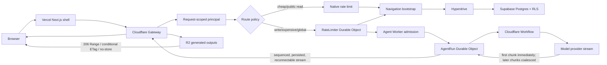
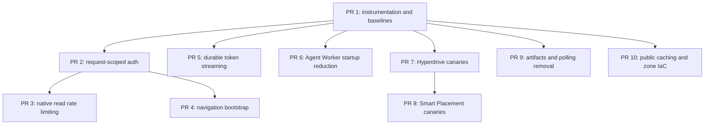

# Cloudflare Critical-Path Performance Initiative

## Overview

Improve Cheatcode's signed-in startup, agent time-to-first-token, Worker cold-start behavior,
database path, and generated-output delivery without moving the Next.js frontend from Vercel.

The frontend remains on Vercel because the measured frontend path is already fast and Cheatcode is
using the native Next.js platform. The work below removes avoidable hops and buffering in the
Cloudflare request path, where the larger gains are available.

This is an initiative composed of independently deployable pull requests. Do not combine it into a
single release. Phase 0 establishes comparable measurements; every later phase has its own feature
flag, canary, or additive rollback path.

### In scope

- End-to-end latency and product-milestone telemetry.
- Safe `Server-Timing`/`Timing-Allow-Origin` response telemetry and production percentile dashboards.
- One request-scoped authenticated principal in the Gateway.
- Cloudflare native rate limiting for availability-friendly read paths.
- A bounded, set-based sidebar bootstrap endpoint.
- A DNS-only Vercel apex with an explicit browser preconnect to the Gateway.
- True, reconnectable model token streaming with Workflow retry safety.
- Agent Worker startup and bundle profiling, then evidence-backed reduction.
- Hyperdrive endpoint/configuration reconciliation.
- Smart Placement canaries.
- R2 range and conditional delivery for generated outputs.
- Event-driven or backed-off active-run and preview status refresh.
- An explicit Cloudflare cache matrix and zone-setting drift control in approved IaC.

### Out of scope

- Migrating or proxying the Vercel frontend through Cloudflare.
- Low-priority minification, Early Hints, speculative loading, or dashboard-only toggles.
- Hyperdrive query caching for tenant-scoped application queries.
- Changing database vendors, auth providers, agent frameworks, or sandbox providers.
- Hard token, step, or cost limits in the semantic agent loop.
- Replacing Durable Objects on strict write, quota, idempotency, or run-stream paths.
- Shared caching of private outputs, arbitrary user previews, or authenticated Gateway responses.

## Desired flow



## Success criteria

Phase 0 records the production baseline and freezes exact absolute SLOs. Until then, use these
relative release gates:

| Area | Release gate |
|---|---|
| Signed-in navigation | Sidebar critical requests fall from 8-12 to 1; database statement count is bounded independently of project count; warm p75 improves by at least 40%. |
| Initial API fan-out | No more than three authenticated requests are needed for the initial signed-in surface; only one is navigation-critical. |
| Gateway auth | Clerk JWT verification, secret resolution, and internal-user resolution each run at most once per request. |
| Cheap reads | No RateLimiter Durable Object call; rejected reads remain safe and observable. |
| Run admission | Initial targets are create-run headers below 500 ms p75 and first status below 750 ms p75; Phase 0 may refine them only with documented production evidence. |
| Model TTFT | First non-empty provider text reaches the AgentRun stream within 100 ms of receipt at the Worker at p75, excluding provider latency. |
| User-perceived TTFT | Initial target is first actual model token below 2.5 s p75, segmented by provider/model/region rather than blended globally. |
| Stream correctness | Reconnect and Workflow retry never duplicate or concatenate two visible generations for the same model turn. |
| Agent startup | Startup falls below 200 ms or improves at least 25% from the measured baseline; compressed upload size does not regress more than 10%. |
| Hyperdrive/placement | Candidate improves p75 by at least 10%, p95 regresses no more than 5%, and error/RLS correctness is unchanged. |
| Output delivery | Valid single byte ranges return 206; matching ETags return 304; invalid ranges return 416; authorization remains unchanged. |
| Reliability | No statistically meaningful increase in 4xx/5xx, canceled-run leakage, connection errors, or stream-reconnect failures. |

The initial measured reference values are a 308 ms local Agent Worker startup, a 2.47 MB gzip
Agent Worker upload, and an 8-12 request signed-in sidebar fan-out. Production latency must be
remeasured in Phase 0 rather than treating local checks as production SLOs.

## UX and behavioral compatibility invariants

These optimizations may change latency and transport internals, but they must not change what users
can do, what data they see, or how existing workflows behave.

1. **No visual redesign.** Navigation structure, copy, controls, responsive behavior, accessibility,
   loading/error affordances, and user interaction semantics remain unchanged unless a separate UX
   change is explicitly approved.
2. **No auth, billing, permission, or tenant-boundary change.** Clerk behavior, verified-email
   requirements, plan entitlements, forced RLS, signed capabilities, and deletion/revocation
   semantics must remain equivalent or stricter.
3. **Additive APIs first.** New bootstrap/status/artifact paths ship beside current endpoints. The web
   client switches only after schema, response, empty/error state, and authorization parity is
   demonstrated. Old paths remain available through the rollout and rollback window.
4. **Agent semantics stay identical.** Model selection, prompts, tools, fallback eligibility,
   semantic-completion loop, tool ordering, cancellation, and persisted conversation content do not
   change. Streaming changes when text is delivered, not what the model/tool loop is asked to do.
5. **Exactly-once visible stream behavior.** Status, text, tool, error, and completion events keep
   their current meaning and order. Reconnects resume from the stored cursor without missing or
   duplicating visible content.
6. **State must converge after disruption.** Sidebar running indicators, active-run state, preview
   readiness, artifacts, and terminal messages recover after refresh, reconnect, Worker restart, or
   a missed event. Event-driven paths retain a bounded fallback read/backoff path.
7. **Private data remains revocable.** Private outputs stay `private, no-store`; Range and ETag
   support must still pass signature and current DB ownership checks before `200`, `206`, or `304`.
   Browser/shared caching must not allow a deleted output to remain accessible.
8. **No legitimate-user rate-limit regression.** Native cheap-read limits launch with sufficient
   headroom and fail open on binding failure. If 429 rate, route behavior, or a documented header
   contract regresses, that route stays on the existing Durable Object limiter.
9. **Performance is not a substitute for reliability.** A phase does not ship merely because its
   median is faster; p95, errors, completion rate, cancel success, reconnect success, and core UX
   flows must meet the non-regression gates.
10. **Every behavioral change has a kill switch or additive rollback.** A user cohort can return to
    the prior path without a data migration, transcript rewrite, or destructive operation.

## Decisions

1. **Keep Vercel for the frontend.** Revisit only if a future platform requirement cannot be met on
   Vercel or a production A/B test shows a material end-user gain.
2. **Keep strict coordination in Durable Objects.** Native rate limits protect cheap reads only;
   writes, expensive reads, run creation, quota, idempotency, and global coordination keep their
   existing strong path.
3. **Do not cache tenant SQL in Hyperdrive.** Signed transaction-local RLS context makes generic
   query caching an unsafe boundary.
4. **Make bootstrap additive.** Existing project/thread/search endpoints remain available for other
   consumers and instant rollback.
5. **Stream through AgentRun, not directly from Workflow to the client.** AgentRun remains the owner
   of ordering, persistence, authorization, cancellation, and reconnect cursors.
6. **Flush the first text immediately; coalesce only subsequent tiny deltas.** Use a maximum 25 ms
   interval or 512 UTF-8 bytes, whichever occurs first, and retain the existing per-event byte cap.
7. **Never restart generation after visible output.** Fallback/retry is allowed before the first
   visible delta. After a visible delta, fail the turn with the partial output intact rather than
   concatenating a second nondeterministic answer.
8. **Profile before splitting the Agent Worker.** A Worker boundary move is conditional on measured
   import/startup evidence and requires a separate architecture decision.
9. **Canary Hyperdrive and Smart Placement independently.** Do not combine them in one experiment;
   otherwise their effects cannot be attributed or safely rolled back.
10. **Private artifact responses remain `no-store`.** Range and ETag/conditional support reduce
    transfer and enable resumable clients without weakening deletion/revocation behavior. Any future
    browser-private caching requires a separate security and UX decision.
11. **Keep the Vercel apex DNS-only.** Do not orange-cloud the frontend merely to create a
    same-origin API. Keep the existing one-day preflight cache and preconnect the browser to the
    Gateway origin.
12. **Keep greeting/weather outside critical bootstrap.** The selected strategy is one navigation
    bootstrap, not a mega-bootstrap whose availability or latency depends on external weather data.
13. **Treat direct Supabase as the expected Hyperdrive production target.** Hyperdrive already
    pools upstream connections. Verify the live endpoint and correctness, then align repository
    setup/docs to direct; use a session-pooler canary only as a contingency if direct-path evidence
    fails the release gate.
14. **Cache only dedicated public data.** Any stale-tolerant catalog/reference cache uses a separate
    public Hyperdrive/Worker entrypoint; current tenant/RLS traffic remains cache-disabled.

## Phase and PR sequence



PRs 3, 4, 5, 6, 9, and 10 can be developed independently after their dependencies land, but each must
be canaried and evaluated separately. Hyperdrive must be resolved before Smart Placement testing.

## Phase 0: measurement foundation

### Goal

Make every optimization attributable by recording the latency segments that currently disappear
inside aggregate route duration.

### Implementation

1. Extend `packages/observability/src/analytics.ts` only where required; retain the existing
   `PerformanceMetric` fields (`dbQueryMs`, `llmMs`, `queueWaitMs`, `sandboxMs`, `totalMs`, and
   `ttftMs`) and add bounded milestone/variant fields rather than a new telemetry vendor.
2. Add a request-local timing collector in `packages/observability/src/worker-runtime.ts`. Emit one
   final metric per request plus explicit milestones for:
   - Gateway arrival;
   - auth secret resolution;
   - Clerk JWT verification;
   - internal-user resolution/sync;
   - rate-limit decision;
   - Hyperdrive handle creation/acquisition;
   - signed RLS transaction setup;
   - database operation/query time;
   - service-binding and Durable Object time;
   - Workflow acceptance;
   - response headers returned;
   - first status event;
   - provider request start and first actual non-empty model text;
   - first persisted model-text chunk;
   - final model token and durable run completion.
   Include release SHA/Worker version, request colo, the safe `cf-placement` value when present,
   reconnect/new-stream state, provider/model where applicable, and experiment variant. Do not use
   a user ID as an Analytics Engine index for performance dashboards.
3. Thread the collector through `apps/gateway-worker/src/index.ts`,
   `apps/gateway-worker/src/authenticate.ts`, `apps/gateway-worker/src/rate-limit.ts`, and
   `packages/db/src/client.ts`. Keep user IDs, tokens, SQL text, credentials, and provider payloads
   out of metrics.
4. Extend `apps/agent-worker/src/durable-objects/agent-run-performance.ts` so provider-first-text,
   AgentRun-first-model-text, first status, final token, and completion are separate timestamps.
   Status/error/sandbox chunks must not satisfy the model-text TTFT metric. Preserve a distinct
   first-status metric for perceived responsiveness.
5. Extend `apps/web/src/lib/rum.ts` with product milestones: auth ready, shell interactive,
   navigation data ready, browser receiving API headers, run submitted, stream connected, first
   status, first model text, final text, and reconnect recovery. Continue sending Web Vitals through
   the current Gateway endpoint.
6. Add a reproducible read-only performance script under `scripts/worker-performance-report.ts`
   that runs Wrangler startup checks/dry-run bundles for all Workers and emits stable JSON plus a
   human-readable table. Add a root package script without replacing the required verification
   chain.
7. Add a safe `Server-Timing` allowlist for coarse phases such as edge handling, auth, admission,
   and upstream wait. Add `Timing-Allow-Origin` for the canonical Vercel web origin. Never expose
   tenant identity, SQL text, provider names/keys, internal object IDs, or security-sensitive timing
   detail. Verify that streaming metrics measure body delivery separately from time-to-Response.
8. Build p50/p75/p95 dashboards from Analytics Engine and correlate them with automatic Workers
   traces, Hyperdrive connection/query metrics, Durable Object metrics, and Workflow metrics. Every
   chart must filter by release/variant and distinguish cold/warm, new/reconnect, colo/placement,
   route, provider/model, and status class where applicable.
9. Document the metric names, dimensions, sampling, Server-Timing allowlist, dashboard queries, and
   redaction contract in
   `packages/observability/README.md` and the Gateway/Agent Worker READMEs.

### Verification and rollout

- Run the full repository gate chain.
- Exercise signed-in home, chat navigation, run creation, first model text, cancellation, and stream
  reconnect with `agent-browser --auto-connect --session cheatcode-debug`.
- Inspect browser network/console and Workers Logs/Analytics Engine; verify one coherent trace ID
  and no secrets or prompt content. Confirm browser Resource Timing can read the allowlisted server
  phases because `Timing-Allow-Origin` is present.
- Collect at least 24 hours of production p50/p75/p95 by route, colo/region, release SHA, and Worker
  version before freezing the absolute SLO dashboard.
- This phase is telemetry-only and rolls back by disabling emission/sampling, not by deleting the
  schema.

## Phase 1: request-scoped Gateway principal

### Goal

Resolve authenticated identity once per request and reuse it across route admission and optional
verified-email checks.

### Implementation

1. Introduce `apps/gateway-worker/src/auth-context.ts` with a strict request-scoped principal:
   internal `UserId`, Clerk user ID, verified session claims, and lazy verified-primary-email state.
   Store a memoized `Promise` in Hono variables; never use module scope.
2. Add the resolver to `GatewayVariables` in `apps/gateway-worker/src/gateway-env.ts` and initialize
   it in the `/v1/*` middleware in `apps/gateway-worker/src/index.ts` next to the request-scoped
   database handle.
3. Refactor `apps/gateway-worker/src/authenticate.ts` so:
   - secret resolution and JWT verification happen once;
   - internal-user lookup/lazy sync happens once;
   - concurrent route consumers await the same promise;
   - failures reject consistently and are not retried within the request;
   - the existing deletion and lazy-sync semantics remain unchanged.
4. Refactor `apps/gateway-worker/src/agent-http-routes.ts` so create-run reuses verified JWT claims.
   Call Clerk Backend API only for the primary-email status that is absent from trusted claims, and
   memoize that lookup for the request.
5. Evaluate making verified-primary-email state webhook-synchronized. The current `users` schema
   stores the primary email but not its verification state. If Clerk webhook payload ordering and
   freshness can support an authoritative state, add an append-only DB migration and update
   `apps/webhooks-worker/src/clerk.ts`; retain a bounded Clerk lookup for missing/stale state. Never
   trust a stale local `true` after a newer Clerk event indicates otherwise.
6. Update each Gateway route collection and `apps/gateway-worker/src/agent-forwarding.ts` to read
   the principal from context rather than independently authenticating.
7. Update `apps/gateway-worker/README.md` with the request identity lifecycle and explicitly state
   that no cross-request auth cache exists.

### Edge cases

- Missing/expired tokens, key rotation, deleted Clerk users, first-request lazy sync, concurrent
  principal consumers, and create-run with an unverified email.
- A failed verified-email lookup must not corrupt the already-authenticated principal.
- Out-of-order/duplicate Clerk webhooks and a local verification record older than the verified JWT
  or Clerk user timestamp.
- Database handles still close exactly once in the outer middleware.

### Acceptance

- Instrumentation proves one JWT verification and one internal-user resolution per request.
- Route response/error contracts are unchanged.
- Create-run no longer verifies the JWT twice.
- Rollback is a code deploy; no schema or configuration migration is involved.

## Phase 2: native rate limiting for cheap reads

### Goal

Remove the RateLimiter Durable Object hop from safe, high-volume read paths while preserving strict
coordination where correctness or cost requires it. This also removes dependence on the current
public Durable Object limiter's 256 geographically sticky shards for these approximate read limits.

### Implementation

1. Add Cloudflare rate-limit bindings for `publicRead` and `readCheap` in
   `apps/gateway-worker/wrangler.jsonc`, using distinct namespaces and the current 60-second limits.
2. Add a `RateLimit` binding validator in `packages/env/src/worker-shared.ts`, wire it through
   `packages/env/src/gateway-worker.ts`, and type both bindings in
   `apps/gateway-worker/src/gateway-env.ts`.
3. Split `apps/gateway-worker/src/rate-limit.ts` into two explicit strategies:
   - native, per-location approximate limiting for `publicRead` and `readCheap`;
   - the existing Durable Object limiter for `publicWrite`, `readExpensive`, `runsCreate`, and
     `writeNormal`.
4. Key authenticated native reads by internal user ID plus route class; key public reads by the
   existing privacy-safe client identifier. Do not key on raw authorization headers.
5. Successful native-limited reads omit `RateLimit-Remaining` and `RateLimit-Reset`, because the
   binding does not provide canonical global state. A rejected request returns the existing error
   envelope, `429`, and `Retry-After`. Strict Durable Object routes keep their current canonical
   headers.
6. Emit strategy, allow/reject, route class, and binding failure metrics. Preserve fail-open only for
   cheap reads and fail-closed behavior for strict routes.
7. Update Gateway README and any API documentation that currently promises canonical rate-limit
   headers on every response.

### Acceptance

- Cheap/public read traces contain no RateLimiter Durable Object segment.
- Write, expensive-read, run-creation, quota, and idempotency behavior is byte-for-byte compatible.
- Burst tests account for native per-location approximation and do not assert a globally exact
  counter.
- Rollback changes route policy back to the existing Durable Object without removing bindings.

## Phase 3: one navigation bootstrap request

### Goal

Replace the initial sidebar's project/thread N+1 fan-out with one authenticated request and a fixed
number of set-based database statements.

### API contract

Add `GET /v1/bootstrap/navigation?activeThreadId=<uuid>` with a strict response schema in
`packages/types/src/api.ts`:

- `recentThreads`: the latest 20 visible threads across the tenant;
- `projects`: the latest six project summaries, each with its latest visible thread or `null`;
- `activeThread`: the requested active thread or `null`;
- `activeProject`: the active thread's project or `null`, included even when it is outside the six
  recent projects.

Do not include greeting/weather data in this endpoint; external data must not delay critical
navigation.

### Implementation

1. Add `packages/db/src/navigation-bootstrap.ts` and export it from
   `packages/db/src/index.ts`. Load the response in one `withUserDb` transaction using bounded,
   set-based queries. Use a window/lateral query for the latest thread per selected project; never
   loop over project IDs. Parallelize truly independent non-database work after authentication, but
   do not `Promise.all` statements on the same transaction-pinned `max: 1` connection; collapse that
   work into set-based SQL instead.
2. Reuse existing project/thread mappers and branded IDs. Add an index only if `EXPLAIN` on
   production-shaped data shows the current recent-thread/project indexes are insufficient; any DB
   change follows `generate -> review -> dry-run -> approved apply`.
3. Add `apps/gateway-worker/src/bootstrap-http-routes.ts` and
   `apps/gateway-worker/src/bootstrap-routes.ts`, register them from
   `apps/gateway-worker/src/index.ts`, and apply one principal resolution plus one cheap-read rate
   decision.
4. Add `apps/web/src/lib/api/navigation-bootstrap.ts` with response validation and add
   `sidebarKeys.navigation(activeThreadId)` in `apps/web/src/lib/api/query-keys.ts`.
5. Refactor `apps/web/src/components/shell/sidebar-data.ts` and
   `apps/web/src/components/shell/sidebar-controller.ts` to use one query. Preserve the existing UI
   return shapes so view components do not absorb transport concerns.
6. Seed compatible project/thread detail caches from the bootstrap response where it avoids later
   duplicate reads; do not make those caches the source of authorization truth.
7. Update create/rename/delete/move mutations in the sidebar components and
   `invalidateChatLists()` to invalidate the navigation bootstrap key as well as any detail keys.
8. Keep existing list/detail endpoints operational for project pickers, settings, pagination,
   deep links, and rollback.
9. Keep `trycheatcode.com`/the Vercel apex DNS-only. Add `<link rel="preconnect">` and DNS-prefetch
   for `https://gateway.trycheatcode.com` in `apps/web/src/app/layout.tsx`; do not proxy `/v1`
   through Vercel or orange-cloud the apex. Retain the Gateway's one-day CORS preflight cache.

### Edge cases and acceptance

- Zero projects, project-less chats, deleted records, an unknown active thread, an active project
  outside the first six, running-chat indicators, slow database, and signed-out transitions.
- Query count is fixed regardless of project count; response size is bounded and Zod-validated.
- The sidebar renders from one critical API request; home greeting may remain a separate noncritical
  request.
- The complete initial signed-in surface uses no more than three authenticated requests, and the
  preconnect is established before the first Gateway fetch.
- Rollback switches the web query hook to the old endpoints; the additive endpoint can remain.

## Phase 4: true durable model streaming

### Goal

Replace the buffered `.generate()` model turn with provider token streaming while retaining
Cloudflare Workflow retries, Durable Object ordering, reconnection, tool checkpointing, fallback,
and cancellation correctness.

### Durable turn protocol

Use a stable turn ID derived from the current Workflow identity and model step index. Store turn
lease/status, first-visible state, logical model, and chunked final result in namespaced
`run_state` keys in the existing AgentRun SQLite schema. Chunk final serialized state below the
one-megabyte value bound and store a manifest/hash last. This avoids an incompatible table change
for existing Durable Objects.

AgentRun exposes narrow Workflow-authenticated operations:

- `beginModelTurn`: return `new`, `leased`, `partial`, or a validated completed result;
- `appendModelTurnChunks`: atomically deduplicate deterministic event keys, append UI chunks, and
  renew the lease;
- `completeModelTurn`: validate the accumulated result, persist chunked result plus manifest/hash,
  then mark complete;
- `failModelTurn`: mark whether failure occurred before or after visible output;
- `readModelTurn`: replay a completed result to a retried Workflow step without a provider call.

### Implementation

1. In `packages/agent-core/src/mastra/durable-agent-step.ts`, add a streaming model-step API using
   the Mastra/AI SDK stream interface. It must expose text deltas as they arrive and return the same
   validated final `finishReason`, response messages, text, and tool calls currently returned by
   `generateGeneralAgentStep()`.
2. Retain the buffered function temporarily behind the streaming rollout flag for rollback. Keep
   DeepSeek provider options and active-tool selection identical.
3. Add `apps/agent-worker/src/durable-objects/agent-run-model-turn.ts` for the turn state machine,
   lease checks, result chunking/hash verification, and deterministic event keys. Reuse
   `appendAgentRunMessagePartOnce()` and the existing message-part byte bounds.
4. Add the narrow RPC methods to `apps/agent-worker/src/durable-objects/agent-run.ts`. Every method
   must validate the current Workflow callback/input hash, deletion tombstone, cancellation state,
   and lease owner before mutating storage.
5. Refactor `generateWithCredential()` and `generateWorkflowModelStep()` in
   `apps/agent-worker/src/durable-objects/agent-run-workflow-runtime.ts`:
   - acquire the turn before contacting the provider;
   - return an already-completed turn on Workflow retry;
   - emit `text-start` and the first non-empty delta immediately;
   - coalesce subsequent deltas for at most 25 ms or 512 UTF-8 bytes;
   - accumulate the exact final model result;
   - mark the turn complete before returning from the Workflow step.
6. Refactor `publishModelStep()` in
   `apps/agent-worker/src/durable-objects/agent-run-workflow.ts` so it persists selected model and
   advances Workflow state without publishing model text a second time. It may publish metadata and
   close an open text part only through deterministic once-only keys.
7. Fallback behavior:
   - primary failure before visible output may release/fail the primary attempt and run the existing
     OpenAI fallback under the same logical turn;
   - failure after visible output is terminal for that turn and must not start fallback;
   - `data-model-fallback` is emitted exactly once before fallback text.
8. Cancellation aborts the provider stream, prevents later chunks, closes any open UI part with the
   existing error protocol, and leaves reconnectable partial output. A stale Workflow cannot append
   after cancel/delete/replacement.
9. Extend `apps/agent-worker/src/durable-objects/agent-run-performance.ts` with provider first text,
   first durable append, coalescing delay, completed-turn replay, and post-visible failure metrics.
10. Keep stream responses `private, no-store` and add `no-transform` in
    `apps/agent-worker/src/streaming/ui-message-stream.ts`. Run an A/B canary with compression
    disabled for only the stream route to detect compressor/proxy buffering; keep the winning
    variant based on first-model-text p75/p95 and bandwidth, not assumption.
11. After run identity, pending Workflow intent, and recovery state are durably committed, add an
    admission fast path that returns create-run headers immediately and emits a status/heartbeat
    event. Move Workflow initiation or Gateway idempotency completion out of the response critical
    path only after termination-injection tests prove the committed recovery protocol can resume
    them exactly once. Until that proof exists, keep them awaited.
12. Update Agent Worker and agent-core READMEs with the retry/visibility and admission-recovery
    invariants.

### Acceptance matrix

- Text-only completion, tool-only turn, mixed text/tool turn, multiple tool calls, provider length
  continuation, DeepSeek large output, primary fallback, explicit-model no-fallback, cancellation
  before/after first text, client disconnect/reconnect, DO restart, Workflow retry before first text,
  Workflow retry after completion, and injected failure after visible text.
- Transcript sequence is monotonic and exactly once. Final persisted conversation equals the model
  result and contains no duplicated prefix.
- Existing stream cursors reconnect mid-turn without restarting generation.
- Create-run headers target p75 below 500 ms, first status p75 below 750 ms, and first actual model
  token p75 below 2.5 s segmented by provider. Phase 0 may refine these only with recorded evidence.
- Feature flag permits immediate fallback to buffered generation for new turns; already-started
  streaming turns retain their stored protocol version.

## Phase 5: Agent Worker startup and bundle reduction

### Goal

Reduce cold-start exposure without moving architectural boundaries speculatively.

### Implementation

1. Use `scripts/worker-performance-report.ts` and `wrangler check startup` to capture raw/gzip
   bundle size, startup time, and the
   largest/transitively expensive modules for every Worker. Store budgets in a small checked-in
   config, not generated build output.
2. Profile module initialization beginning at `apps/agent-worker/src/index.ts`,
   `packages/agent-core/src/mastra/index.ts`, and
   `packages/agent-core/src/mastra/agents/general.ts`.
3. Remove or defer only measured eager work:
   - module-level object construction not needed for admission/stream attach;
   - provider SDK initialization before a credential/model is selected;
   - unrelated workflow/agent registration on paths that do not execute them;
   - duplicate dependency copies identified in the Wrangler metafile/lockfile.
4. Preserve static Worker-compatible imports where dynamic loading would break bundling or runtime
   compatibility. Verify every change against all four model providers and the research/tool
   registry.
5. Add a CI performance report and fail only on agreed regression budgets. Do not make local startup
   variance a flaky single-sample gate; use repeated median measurements and a size hard limit.
6. If measured evidence still cannot reach the success gate, write a separate architecture decision
   for lightweight latency-sensitive Workers and heavy execution. Candidate extractions are signed
   artifact delivery, status/stream transport, preview coordination, and finally model execution.
   Connect them through fetch-based Service Bindings so latency-sensitive calls avoid public
   network/auth overhead and remain eligible for placement. The decision must validate
   cross-Worker Workflow/DO/service-binding support, failure ownership, deployment order, and cost
   before implementation.

### Acceptance

- Agent Worker reaches a 25-40% startup CPU reduction (or falls below 200 ms) without increasing run
  errors or removing capabilities, and production cold-path p95 confirms the local result. The
  current raw 13.8 MB/2.47 MB gzip bundle is the initial size reference, not a permanent budget.
- Gateway, webhooks, and preview bundles do not regress.
- Each lazy/deferred boundary has a cold-path browser/run verification, not only a build check.
- Rollback is per optimization. A Worker split is not part of this phase unless separately approved.

## Phase 6: Hyperdrive reconciliation

### Goal

Verify the current direct Supabase port-5432 production targets, align repository setup/documentation
with Cloudflare's direct-endpoint recommendation, and keep tenant query caching disabled.

### Implementation

1. With the Phase 0 timings, separate handle creation, connection acquisition, signed-context setup,
   first query, transaction body, commit, and close in `packages/db/src/client.ts`.
2. Inventory the three production Hyperdrive configurations referenced by:
   - `apps/gateway-worker/wrangler.jsonc` (`app_gateway`);
   - `apps/agent-worker/wrangler.jsonc` (`app_agent`);
   - `apps/webhooks-worker/wrangler.jsonc` (`app_webhooks`).
   Record only config IDs, role names, region, endpoint class, cache state, and connection limits;
   never persist connection strings or secrets.
3. Confirm Supabase database region, direct endpoint, TLS requirements, exact role identity, and
   available connection headroom. Treat any unexpected session-pooler target as drift.
4. Create fresh canary Hyperdrive configs against the direct endpoint with query caching disabled
   and the same least-privilege role. Do not mutate all production bindings in place. A
   session-pooler candidate is a contingency only if direct-path latency, saturation, or correctness
   fails the release gate.
5. Validate the direct config under signed-in bootstrap, run persistence, webhook processing,
   concurrency, connection churn, and failure recovery. Include RLS identity assertions and
   transaction-local context tests.
6. Tune origin connection limits only after confirming database headroom; retain the request-scoped
   driver pool `max: 1` unless profiling proves a safe need for intra-request concurrency.
7. Promote verified direct config IDs Worker by Worker, starting with Gateway, then Agent, then
   webhooks. Update repository setup so it no longer requires the session pooler. Align Wrangler
   config, operational setup scripts, app READMEs, and `packages/db/README.md` with the selected
   production truth.
8. Inventory public, stale-tolerant catalog/reference reads. Only if such reads are material, create
   a separate cache-enabled Hyperdrive configuration and dedicated public Worker entrypoint with no
   tenant/RLS/auth/billing queries. Document staleness because cached SELECTs are not invalidated by
   application writes.
9. Keep Hyperdrive query caching off for all current tenant/auth/billing/RLS traffic.

### Acceptance and rollback

- All three runtime roles remain least-privilege and exact; no `service_role` or migration login is
  used.
- Signed context and forced RLS tests pass under load and connection reuse.
- Verified direct config meets the latency/error gate for at least 24 hours before full promotion.
- Rollback rebinds the prior Hyperdrive config ID; no database migration is involved.

## Phase 7: Smart Placement canaries

### Goal

Determine whether placed, database-heavy fetch entrypoints help without moving the user-facing
Gateway away from users or relying on placement for unsupported named/RPC entrypoints.

### Implementation

1. Keep the public Gateway user-near and unplaced. Add placement only to staging/canary fetch
   entrypoints in the relevant `wrangler.jsonc` and deploy workflow. Test database-heavy fetch and
   Agent execution surfaces separately; do not enable all Workers at once.
2. Record user colo, actual execution location/placement status, database phase time, Durable Object
   time, service-binding time, provider/sandbox time, total time, release SHA, and variant.
3. Run representative traffic from India, North America, and Europe for:
   - signed-in navigation bootstrap;
   - create-run admission and stream connection;
   - a text-only model turn;
   - a sandbox/tool-heavy run.
4. For a database-heavy Gateway operation such as navigation bootstrap, canary a placed Worker
   reached through a fetch-based Service Binding while the public Gateway remains user-near. Do not
   use a named/RPC entrypoint for placement-critical calls.
5. Evaluate Agent fetch entrypoints independently because its dominant dependencies include model providers, Daytona,
   Durable Objects, R2, and Postgres rather than one origin.
6. Promote only the specific Worker whose p75 improves at least 10%, p95 regresses no more than 5%,
   and error/cold-start rates remain stable across all tested regions.
7. For newly created named Durable Objects, pass a best-effort location hint derived from the
   initiating user region or Daytona target when the Cloudflare API permits it. Hints are advisory,
   must not become an authorization input, and must not alter deterministic object names.
8. Do not attempt to relocate existing Durable Objects. Record hinted versus actual location and
   accept that existing objects remain sticky.

### Rollback

Disable placement on the affected Worker version and redeploy. No DNS, storage, or database change
is coupled to this phase.

## Phase 8: artifacts, previews, and polling removal

### Goal

Make large generated outputs resumable and conditionally cacheable, reduce redundant artifact work,
and replace fixed active-run/preview polling where existing Durable Object streams can carry state.

### Implementation

1. Add a focused HTTP helper such as
   `apps/agent-worker/src/r2-download-response-support.ts` that:
   - parses one RFC-compatible `bytes` range (closed, open-ended, or suffix);
   - rejects malformed or multi-range requests;
   - maps the validated range to `R2Bucket.get(key, { range })`;
   - returns `206`, `Content-Range`, `Content-Length`, and `Accept-Ranges: bytes`;
   - returns `416` with `Content-Range: bytes */<size>` for unsatisfiable ranges;
   - compares `If-None-Match` against R2 `httpEtag` and returns `304` only after signed capability
     and tenant ownership validation.
2. Refactor `downloadOutput()` in `apps/agent-worker/src/agent-api-system-routes.ts` to use the
   helper while preserving signature verification, `findDownloadableOutput()`, content type,
   sanitized content disposition, `nosniff`, and `Referrer-Policy: no-referrer`.
3. Set `ETag`, `Accept-Ranges`, and exact length on complete responses. For successful GET/206,
   retain `Cache-Control: private, no-store`. Honor `If-None-Match` only after signature and current
   DB ownership checks, so a client-supplied validator can receive `304` without weakening
   deletion/revocation. Do not add `immutable` or a positive private-cache TTL in this initiative.
4. Forward stored R2 HTTP metadata only through an allowlist (`Content-Type`, language/encoding when
   valid, cache validators, and length); security headers and sanitized content disposition remain
   application-owned.
5. Remove the mint route's extra R2 `head()` only after verifying that `generated_outputs` is
   committed strictly after a successful R2 upload. The download `get()` remains the object
   existence check, and the download route must recheck DB ownership because outputs can be deleted
   during a capability's one-hour lifetime.
6. Consider HEAD only if the Gateway-to-Agent route manifest can express it without duplicating an
   ambiguous route. HEAD is not required for the first release; browser range and conditional GET
   deliver the material gain.
7. Keep artifact delivery in the Agent Worker for the first range/ETag release. If Phase 5 profiling
   shows this heavy bundle materially affects artifact cold p95, move the signed delivery route and
   R2 binding into the approved lightweight artifact Worker through a fetch Service Binding.
8. Replace the fixed two-second active-run polling in
   `apps/web/src/components/projects/projects-shell.tsx` with the existing AgentRun stream's terminal
   status/event followed by one detail invalidation. Use exponential backoff plus visibility pause
   only as a recovery fallback when the stream is unavailable.
9. Replace fixed preview/status polling in
   `apps/web/src/components/preview/use-ensure-preview-live.ts` and polling in
   `apps/web/src/components/preview/sandbox-ide-tab.tsx` with ProjectSandbox/AgentRun lifecycle
   events where those state owners already know the transition. Retain bounded exponential backoff,
   focus/visibility gating, and manual retry as the degraded path.
10. Keep preview console cursor polling only while the console surface is visible until a bounded
    event transport exists; immediately switch it from fixed cadence to exponential idle/error
    backoff in `apps/web/src/components/preview/use-preview-console.ts`.
11. Cache only immutable code-server assets. Never cache arbitrary user previews, capability URLs,
    preview HTML, terminal/console data, or mutable sandbox responses.
12. Document that capability URLs remain sensitive and must not enter logs, analytics, or referrers.

### Acceptance

- Full object, first/last/open/suffix ranges, zero-byte object, malformed range, unsatisfiable range,
  matching/nonmatching ETag, expired signature, wrong user, missing DB row, missing R2 object, and
  UTF-8/special-character filename cases.
- 304 and 206 are never returned before authorization and ownership checks.
- Memory remains streaming/bounded; the Worker never buffers the entire object.
- Active-run completion updates through the run stream without a two-second poll; fallback polling
  backs off, pauses while hidden, and converges after reconnect.
- Preview lifecycle changes are event-driven where the state owner can emit them; degraded polling
  does not create a constant background request loop.
- Rollback restores whole-object GET; the `no-store` security contract, object data, and signed URLs
  remain valid throughout rollout.

### Conditional shared delivery path

Only if telemetry shows substantial repeat reads of immutable public thumbnails/artifacts, design an
R2 custom-domain path protected by a scoped HMAC/WAF rule and Tiered Cache. Private user outputs stay
off shared cache by default. This is not a prerequisite for range/ETag delivery.

## Phase 9: selective caching and Cloudflare zone controls

### Goal

Make caching/security protocol intent explicit and drift-controlled without applying shared caching
to authenticated or user-generated traffic.

### Cache matrix

| Surface | Policy |
|---|---|
| Public catalogs/reference metadata | Dedicated public entrypoint; bounded stale-tolerant cache when telemetry justifies it. |
| Release metadata and public skill metadata | Public cache with explicit TTL, validators, and purge/version strategy. |
| Immutable public assets | Long-lived immutable cache; Tiered Cache only when repeat-read metrics justify it. |
| Authenticated APIs, Clerk, billing, permissions | Never shared-cache. |
| Webhooks, agent streams, run status, user outputs | Never shared-cache; private stream/output rules from earlier phases apply. |
| User previews, preview capabilities, terminal/console data | Never shared-cache; only immutable code-server assets are eligible. |

### Implementation

1. Inventory every public Gateway/Worker route and classify it in a checked-in cache-policy manifest.
   A new route must choose a policy explicitly; absence defaults to bypass.
2. Evaluate Cloudflare Workers Caching only on dedicated public entrypoints where bypassing Worker
   execution, request collapsing, and tiered delivery materially help. Do not enable it on the
   authenticated Gateway.
3. Define cache rules and bypasses for the matrix. Auth/cookie/capability-bearing requests fail
   closed to bypass even if a route is otherwise public.
4. Put HTTP/3, TLS 1.3, Compression Rules, cache rules/bypasses, and any approved R2 Tiered Cache
   configuration into Terraform or equivalent declarative IaC. Because the repository has no
   current zone-IaC source of truth, first add an architecture decision selecting the tool, state
   ownership, secret handling, CI plan/apply permissions, and emergency rollback process.
5. Import the existing zone state before changing it. The Gateway already demonstrates HTTP/3 and
   zstd, so protocol settings are verification/drift-control tasks rather than expected latency
   wins.
6. Add CI drift checks and a reviewed apply workflow. Production apply credentials remain outside
   the repository and changes must produce a human-readable plan artifact.
7. Add synthetic/public-route checks for cache status, TTL, validator behavior, auth bypass,
   compression, HTTP/3, and TLS policy. Never use cached success as proof that the Worker route
   itself remains healthy.

### Acceptance and rollback

- Every public route has an explicit cache/bypass policy and private surfaces always bypass.
- IaC plan is clean after apply; out-of-band zone drift is visible in CI.
- Existing HTTP/3, TLS 1.3, and zstd behavior remains available where compatible.
- Rollback applies the previous reviewed IaC state; cache purge does not require application data
  deletion.

## Cross-phase deployment policy

1. Land Phase 0 first with no user-visible behavior change and tag every metric with release SHA and
   experiment variant.
2. Before switching users, run contract/parity checks against production-shaped data:
   - compare bootstrap output with the existing sidebar endpoints, including empty/deleted/active
     states;
   - run the native rate limiter in decision-only shadow mode while the Durable Object remains
     authoritative;
   - compare Hyperdrive/placement candidates with identical RLS identity assertions;
   - validate streaming on internal runs rather than dual-calling nondeterministic model providers.
3. Ship each behavior change disabled or additive, then enable for staff/internal accounts, 1%, 5%,
   25%, 50%, and 100% only after the phase gate holds for a representative window.
4. Never overlap Hyperdrive and Smart Placement experiments.
5. Monitor technical and UX guardrails together: auth success, initial render/sidebar correctness,
   run creation, first status/text, successful completion, cancellation, reconnect, preview ready,
   download success, 429s, and support/error signals.
6. Stop promotion and activate the prior path on elevated 4xx/5xx, auth/entitlement differences,
   RLS assertion failures, stale/missing UI state, stream duplication, canceled-run leakage,
   connection saturation, completion-rate decline, or p95 regression beyond the gate.
7. Keep the previous Worker version/config ID and client code path available for immediate rollback.
   Prefer an automated rollback alarm where the metric is reliable; otherwise use a documented
   one-command kill switch and staffed canary observation.
8. Remove a flag only after full rollout has been stable for at least seven days and the rollback
   release remains buildable.

## Required verification for every implementation PR

Run the repository gate chain:

```bash
pnpm lint
pnpm typecheck
pnpm turbo build --force
pnpm deadcode
pnpm architecture:check
pnpm turbo skills:build
```

Also run relevant package checks and the new Worker performance report. For user-visible or
integration behavior, use the real application with:

```bash
agent-browser --auto-connect --session cheatcode-debug
```

PR verification notes must list commands, production/canary variants, browser flows, screenshots or
network evidence, Workers log/metric evidence, and every omitted check with its reason. This
repository intentionally does not add a separate unit/E2E harness for these changes.

## Documentation and operational updates

Update the relevant source of truth in the same PR:

- `apps/gateway-worker/README.md` for auth, rate limits, bootstrap, headers, and bindings;
- `apps/agent-worker/README.md` for model-turn durability, placement, and output delivery;
- `packages/agent-core/README.md` for streamed model-step behavior;
- `packages/db/README.md` for the selected Hyperdrive endpoint and cache policy;
- `packages/observability/README.md` for metrics and redaction;
- `apps/web/README.md` for the DNS-only frontend, Gateway preconnect, and event/backoff behavior;
- app `wrangler.jsonc` files and deployment workflows for bindings/config IDs/placement;
- the selected zone-IaC/architecture document and cache-policy manifest for protocol/cache controls;
- `packages/types` and package public exports for every new wire contract.

## Risks and mitigations

| Risk | Mitigation |
|---|---|
| Workflow retry duplicates streamed output | Stable turn IDs, deterministic event keys, AgentRun lease, completed-result replay, and no post-visible retry. |
| Token-sized writes overload the Durable Object | Immediate first token, then 25 ms/512-byte coalescing with existing byte bounds and metrics. |
| Native rate limit is not globally exact | Use it only for fail-open cheap reads; retain Durable Objects for strict policies. |
| Bootstrap response becomes another oversized aggregate | Fixed 20 chats/six projects/one latest thread each; strict response schema and response-size telemetry. |
| Hyperdrive endpoint change breaks RLS/session behavior | Same least-privilege roles, cache disabled, canary config IDs, signed-context assertions under connection reuse. |
| Smart Placement helps DB but hurts users | Keep the public Gateway user-near; measure placed fetch entrypoints end-to-end in multiple regions and promote per Worker only. |
| Lazy imports remove provider/tool capabilities | Metafile evidence plus real runs across every provider and tool/research path. |
| Conditional artifact response bypasses revocation | Keep private outputs `no-store`; check signature and current DB ownership before every 200/206/304. |
| Event loss leaves stale preview/run state | Stream sequence/reconnect recovery plus one invalidation; bounded visibility-aware exponential polling remains the degraded path. |
| A broad cache rule exposes tenant data | Checked-in deny-by-default matrix, auth/cookie/capability bypasses, IaC review, and synthetic negative checks. |
| A faster backend changes visible behavior | Additive APIs, shadow parity where deterministic, internal-first canaries, UX guardrail metrics, feature kill switches, and retained old paths. |

## Remaining data-driven decisions

These are experiment outcomes, not blockers to starting implementation:

1. Whether the verified direct Supabase configs need different origin connection limits for
   Gateway, Agent, and webhooks; the session pooler remains a contingency, not the expected target.
2. Whether placed database-heavy fetch and Agent execution entrypoints beat unplaced variants; the
   public Gateway remains user-near.
3. Which measured eager imports should be deferred and whether a lightweight Worker split deserves a separate
   architecture proposal.
4. The absolute p75/p95 SLO numbers frozen after Phase 0's 24-hour baseline.
5. Whether material public/stale-tolerant reads justify a separate cache-enabled Hyperdrive config,
   Workers Caching, or an R2 custom-domain/Tiered Cache path.
